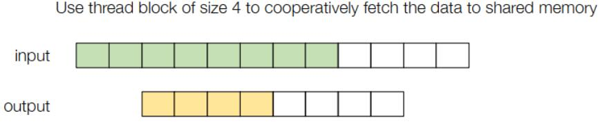

# GPU加速

## 大纲
- GPU programimg
- 举例讲解：GPU上的矩阵乘法

### GPU programimg

#### GPU构造
- GPU和CPU最大的区别在于GPU有很多个核，能同时给很多单位作同类简单运算
- 十分适用于图像渲染与矩阵处理

#### GPU编程（cuda）
- SIMT模式（单指令多线程并行）


- 左侧为逻辑分层图，右侧为硬件内存图
- 特点：
  1. 所有线程执行相同的代码，但可以走不同的路径（if else）
  2. 线程被分组至block中，同一block内线程共享内存（shared memory）
  3. block被分组至grid中，一个内核对应一个grid，同一grid内共享内存（global memory,就是cuda malloc和free的内存）

- 现代GPU编程模型（如CUDA、OpenCL）采用网格（Grid）→ 线程块（Block）→ 线程（Thread）的三层抽象，与硬件的三层结构（GPU芯片 → SM（Streaming Multiprocessors流多处理器，负责执行Block） → 核心/线程束）直接对应

- 举例：向量加法
  CPU中单线程串行执行代码：
```c++
void VecAddCPU(float* A, float *B, float* C, int n) {
    for (int i = 0; i < n; ++i) {
        C[i] = A[i] + B[i];
    } // for循环逐元素处理时间久
}
```


  GPU中多线程并行执行代码，每个线程都会执行此代码，但用block、线程thread的索引就可以调用向量不同元素作相同操作：
```c++
__global__ void VecAddKernel(float* A, float *B, float* C, int n) {
int i = blockDim.x * blockIdx.x + threadIdx.x; 
 // blockDim.x：每个线程块的线程数（如256）
 // blockIdx.x：当前线程块的索引（从0开始）
 // threadIdx.x：线程在块内的索引（从0到blockDim.x-1）
 // 总索引 i = 块大小 × 块索引 + 块内线程索引
    if (i < n) {
        C[i] = A[i] + B[i];
    }
}
```
- 通过线程网格（Grid）和线程块（Block）的层次化并行，一次性启动海量线程处理所有元素，适合大规模数据并行任务
- 但注意不是所有任务在CPU上的代码可以翻译在GPU上跑，需要注意线程间代码的逻辑独立性

- 此向量加法的CPU代码（host side(主机端) code） //封装完整的GPU向量加法流程，包含内存管理、数据传输和核函数调用

```c++
void VecAddCUDA(float* Acpu, float *Bcpu, float* Ccpu, int n) { 
    //Acpu, Bcpu：主机端（CPU）输入数组指针; Ccpu：主机端输出数组指针; n：数组元素数量
    float *dA, *dB, *dC;
    cudaMalloc(&dA, n * sizeof(float));
    cudaMalloc(&dB, n * sizeof(float));
    cudaMalloc(&dC, n * sizeof(float));
    // cudaMalloc：在GPU显存中分配内存，返回设备指针 dA, dB, dC
    cudaMemcpy(dA, Acpu, n * sizeof(float), cudaMemcpyHostToDevice);
    cudaMemcpy(dB, Bcpu, n * sizeof(float), cudaMemcpyHostToDevice);
    // 将输入数据从主机内存拷贝到设备内存，供GPU计算使用
    // cudaMemcpyHostToDevice：指定拷贝方向（CPU → GPU）
    int threads_per_block = 512;
    int nblocks = (n + threads_per_block - 1) / threads_per_block;
    VecAddKernel<<<nblocks, threads_per_block>>>(dA, dB, dC, n);
    /*
    线程块配置：
    threads_per_block：每个线程块包含512个线程（需根据硬件调整，通常为32的倍数）
    nblocks：总线程块数，通过向上取整确保覆盖所有元素
    */
    // 核函数调用语法：<<<grid_size, block_size>>> 指定执行配置
    cudaMemcpy(Ccpu, dC, n * sizeof(float), cudaMemcpyDeviceToHost);
    // 将GPU计算结果 dC 复制回主机内存 Ccpu
    cudaFree(dA); cudaFree(dB); cudaFree(dC);
}

__global__ void VecAddKernel(float* A, float *B, float* C, int n) { // 核函数
    int i = blockDim.x * blockIdx.x + threadIdx.x;
    if (i < n) {
        C[i] = A[i] + B[i];
    }
}
```
- 与此例不同，现实的应用程序通常会尽可能长时间地将数据保存在GPU内存中，而不会在CPU与GPU直接copy多次（耗时长），直接将层间输入输出保存在GPU中
> numpy库就会将GPU上数组copy回CPU中变成NParray，所以需要自己写类似numpy的库


#### 类似GPU编程


没有显著差异

#### 对GPU内存分层的重用策略
- 类似lecture11中的CPU硬件加速策略

##### Emample：window sum


- 问题：将输入的数组每五个累加作为一个输入数组的元素，类似卷积核滑动，简单说就是一个小卷积

代码：
```c++
#define RADIUS 2 // 定义滑动窗口的半径

__global__ void WindowSumSimpleKernel(float* A, float *B, int n) {
    int out_idx = blockDim.x * blockIdx.x + threadIdx.x;
    if (out_idx < n) { // 确保 out_idx 在有效范围内
        float sum = 0;
        for (int dx = -RADIUS; dx <= RADIUS; ++dx) {
            sum += A[dx + out_idx + RADIUS];
        }
        // 遍历关于某输出的五个输入并累加
        // 缺陷：内存调用频繁；当 out_idx 接近数组边界时，可能访问越界
        B[out_idx] = sum;
    }
}
```

- 优化策略：

此图中大小为 4 的 thread block 协同将数据取到共享内存中，每个线程加载 2 次数据（一次本身要加载进共享内存的，一次是前4（2 * radius）个元素要多加载一次末尾输入至共享内存末尾）

- 输入端数据大部分可以重用，故可以利用share memory先储存所有输入端数据，这样就可以被线程共同使用，减少全局内存访问，增加重用率

相应代码：
```c++
__global__ void WindowSumSharedKernel(float* A, float *B, int n) {
    __shared__ float temp[THREADS_PER_BLOCK + 2 * RADIUS]; //为每个线程块分配共享内存，大小为 THREADS_PER_BLOCK + 2*RADIUS，用于缓存当前线程块的数据及相邻区域的元素
    int base = blockDim.x * blockIdx.x;
    int out_idx = base + threadIdx.x;
    // 每个线程负责计算 B[out_idx] 的值
    if (base + threadIdx.x < n) {
        temp[threadIdx.x] = A[base + threadIdx.x];
    } // 每个线程加载一个元素到共享内存中部（temp[threadIdx.x]），覆盖 base 到 base+THREADS_PER_BLOCK-1
    if (threadIdx.x < 2 * RADIUS && base + THREADS_PER_BLOCK + threadIdx.x < n) {
        temp[threadIdx.x + THREADS_PER_BLOCK] = A[base + THREADS_PER_BLOCK + threadIdx.x];
    } // 前 2*RADIUS 个线程（如 threadIdx.x < 4）额外加载右侧 2*RADIUS 个元素到共享内存尾部（temp[THREADS_PER_BLOCK + threadIdx.x]）

    __syncthreads(); // 确保所有线程完成共享内存写入后，再开始后续操作
    if (out_idx < n) {
        float sum = 0;
        for (int dx = -RADIUS; dx <= RADIUS; ++dx) {
            sum += temp[threadIdx.x + dx + RADIUS]; // 用share memory比global memory快
        }
        B[out_idx] = sum; // 写回
    }
}
```
- 运行分为内存写入部分与实际运算部分


### GPU上的矩阵乘法
- 和lecture11中cpu上的矩阵乘法一样，三层结构
  GPU：globel memory - share memory - register
  CPU：主存 - L1缓存 - register

- 代码都只给了GPU上的代码（核函数），host端未给示例

#### register tiling
- 先只看一层register

代码如下：
```c++
__global__ void mm(float A[N][N], float B[N][N], float C[N][N]) {
    int ybase = blockIdx.y * blockDim.y + threadIdx.y;
    int xbase = blockIdx.x * blockDim.x + threadIdx.x;
    // 线程的坐标对应矩阵数据的坐标，所以线程的坐标设计也是有一维二维三维的xyz三个参数，一维二维三维可以互相转化，在矩阵中就只使用xy

    // 每个线程负责计算C中的一个V×V的小块，通过遍历所有k，并累加每个k对应的A和B的小块的乘积


    float c[V][V] = {0};
    float a[V], b[V];
    for (int k = 0; k < N; ++k) { 
        // 矩阵乘法中，x y 决定的是第几行与第几列的元素各自相乘再累加，而k代表的是此行与此列的元素个数，这个外层循环就以此行与此列的每组元素来遍历
        // 举例说明：k=0时，以下遍历的行和列中只进行第0组元素的乘积，再累加在对应的位置上；而和正常的以x y作循环的外层不同，x y作外层循环时是先把一个c[y][x]的结果完全算出来，再换下一个位置，k作外层时是k=n时每个位置只有前n组数据乘积的和
        a[:] = A[k, ybase*V : ybase*V + V];
        b[:] = B[k, xbase*V : xbase*V + V];
        // 把这个线程在k=n时要计算的第n组数据提取出来
        for (int y = 0; y < V; ++y) {
            for (int x = 0; x < V; ++x) {
                c[y][x] += a[y] * b[x];
            }
        }
        // 遍历一边结果c矩阵，在其中每个元素位置上多加一组积（第k=n组）
    }
    C[ybase * V : ybase*V + V, xbase*V : xbase*V + V] = c[:];
    // 存回去，在此是存回global memory，后面会改进
}
```

代码中注释形象化：


- k循环就是给v * v的结果矩阵中每个元素每次累加一组积，而A.T、B中v这一段是由线程的序号决定的，每个线程都计算不同位置的一小段v 


#### shared memory tiling
- 再添加一层share memory的重用关系，越来越贴合三层结构


- 前面是每个线程计算一个v * v的矩阵，现在是每个线程块（block）计算一个L * L的矩阵，矩阵中有若干个线程，即有若干v * v小矩阵，矩阵块的快序号定义取一段L的位置

核代码如下：
```c++
__global__ void mm(float A[N][N], float B[N][N], float C[N][N]) {
    __shared__ float sA[S][L], sB[S][L]; // 为上图中的A.T、B中的S * L小矩阵，存在share memory中方便线程块中线程重用
    float c[V][V] = {0}; // c是每个线程私有的V×V数组
    float a[V], b[V];
    int yblock = blockIdx.y;
    int xblock = blockIdx.x;
    // 获取当前线程块的二维索引(yblock, xblock)，确定该线程块负责计算输出矩阵C中的哪个L×L分块

    for (int ko = 0; ko < N; ko += S) {
        __syncthreads(); // 等待前一循环所有线程计算完再更新新的共享内存
        sA[:, :] = A[k : k + S, yblock * L : yblock * L + L];
        sB[:, :] = B[k : k + S, xblock * L : xblock * L + L];
        // 此处是伪代码，需要按照上图中线程块被分成若干线程一样，此处应是每个线程通过线程index将一部分数据从global memory提到share memory中以被共用
        /*//可展开为
        int nthreads = blockDim.y * blockDim.x; // nthreads：计算线程块中的总线程数
        int tid = threadIdx.y * blockDim.x + threadIdx.x; // tid：将线程的二维索引 (threadIdx.y, threadIdx.x) 转换为线性索引（范围是 [0, nthreads-1]）

        for(int j = 0; j < L * S / nthreads; ++j) { // 每个线程需要从global memory中加载j个数据进share memory，而加载策略中这j个数据的分布是分散的，某线程第一个提取的数据到下一个要 + nthreads 个数据（间隔）
            int y = (j * nthreads + tid) / L;
            int x = (j * nthreads + tid) % L;
            s[y, x] = A[k + y, yblock * L + x]; // k对应ko
        }
        // 加载部分和计算部分可以用不同的线程数，加载确保线程数多，可以更快更连续，计算在线程数够的情况下需要线程中寄存器数量多，让计算更快
        */

        __syncthreads(); // 等待每个线程的提数据工作完成
        for (int ki = 0; ki < S; ++ ki) {
            a[:] = sA[ki, threadIdx.y * V : threadIdx.y * V + V];
            b[:] = sA[ki, threadIdx.x * V : threadIdx.x * V + V];
            for (int y = 0; y < V; ++y) {
                for (int x = 0; x < V; ++x) {
                    c[y][x] += a[y] * b[x];
                }
            }
        }
        // 内循环逻辑和register tiling一样，只不过k从0到N变成ki从0到S
    }
    int ybase = blockIdx.y * blockDim.y + threadIdx.y;
    int xbase = blockIdx.x * blockDim.x + threadIdx.x;
    C[ybase * V : ybase*V + V, xbase*V : xbase*V + V] = c[:];
    // 还是用线程index作全局index来写回数据
}
```

#### 两组权衡
- **register和thread的权衡**
- 因为GPU内register数量是有限的，当一个thread使用了多个register，这样可启动的thread数量就少了，减少了并行性，而thread数量增多那每个thread分配的register就少了，不能充分利用每个thread

- **share memory和block的权衡**
- 当share memory变大时，block能加载的更块，但是block的数量会减少，反之block增多，每个block分到的share memory也会少

  > 选S和V的大小的时候就试验取最佳


### 更多技术加速GPU

- 全局内存连续读入；
- 共享内存库冲突；
- 软件流水线；
- Warp level线程束内优化；
- Tensor Core张量核；


