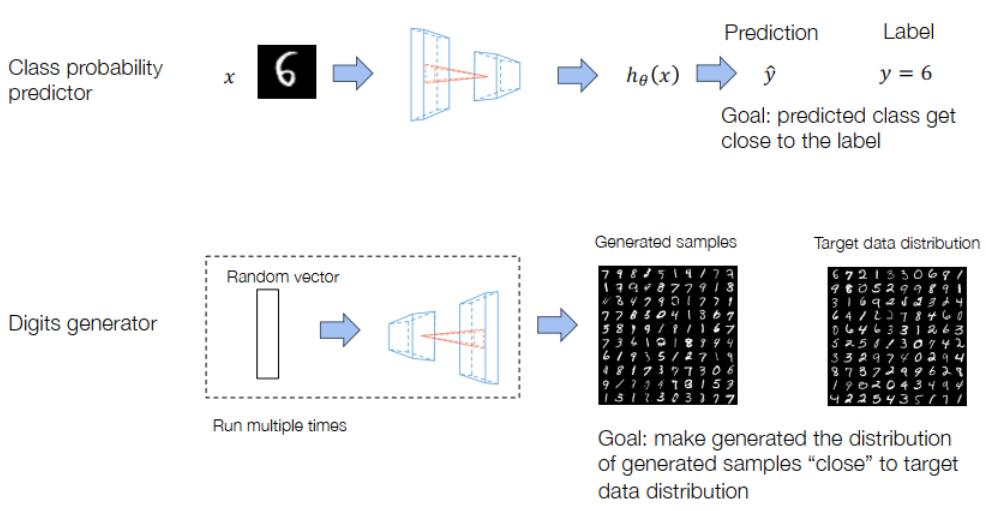
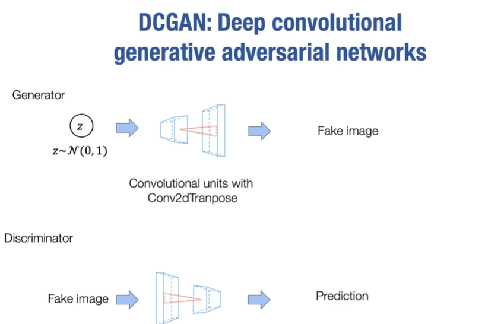
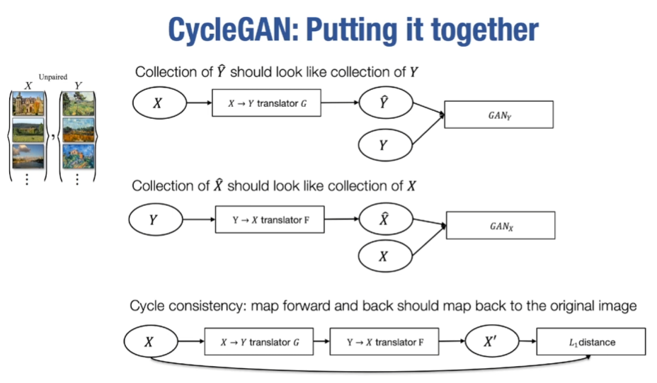

# lecture16
# 生成对抗训练 GAN

## 大纲
- 生成对抗训练的一般机制
- 在深度学习中的对抗训练模块


### 生成对抗训练的一般机制



- 图示是分类器与生成器的目标：
   - 分类器：对输入样本进行类别预测，使预测的类别接近标签
   - 生成器：从无规律的噪声中生成有意义的样本，使生成样本的分布“接近”目标数据分布

- 生成对抗训练中引入了鉴别器（oracle classfier D）：
  - 用来区分输入数据是真实的（来自训练集）还是生成的（来自生成器）
  - 输出是一个概率值，表示输入是真实数据的概率
  - 需要用神经网络来构造鉴别器，其目标就是尽可能判断正确，故此神经网络的损失函数为 $ \min _G\left\{-\mathrm{E}_{z \sim \text { Noise }} \log (D(G(z))\}\right. $ ， ${z \sim \text { Noise }}$ 为从简单分布中随机采样的向量，用于生成假样本G(z)
  > 期望E隐式地度量了两个分布之间的差异，指导生成器、鉴别器参数更新方向
- 生成对抗训练就是生成器与鉴别器的对抗，鉴别器尽可能准确识别真假样本，同时生成器会试图欺骗它
- 最终目标：两者达到平衡，生成器能生成以假乱真的数据，而鉴别器无法区分（输出概率接近0.5）
- 此为无监督学习：不需要标签，只希望能生成一个看起来接近这个目标分布的样本集合

- 如何定义生成器的目标函数：对于任意一个输入z（随机向量），生成网络G的输出为G(z)，D对其的判别结果为D(G(z))（输出来自真实数据集的概率）。那生成器的目标就是尽可能让判别器判别错误，即其损失函数为：
$$ \min _D\left\{-E_{x \sim \text { Data }} \log D(x)-E_{z \sim \text { Noise }} \log (1-D(G(z))\}\right. $$

- 总结鉴别器与生成器的目标函数：
$$ \min _D \max _G\left\{-E_{x \sim \text { Data }} \log D(x)-\mathrm{E}_{z \sim \text { Noise }} \log (1-D(G(z))\}\right. $$

- 训练过程：交替迭代
  1. 更新判别器（D）：固定生成器（G），优化判别器以更好地区分真实数据与生成数据
  2. 更新生成器（G）：固定判别器，优化生成器以生成更逼真的数据欺骗判别器
  > 互相指导变强


### 在深度学习中的对抗训练模块
- 将整个鉴别器作为一个损失函数来实现，当然，其和我们之前实现的损失函数是不一样的，判别器的参数在每轮反向传播时都要更新


#### GAN网络的变体
##### 1. DCGAN 深度卷积生成网络



- 反卷积模块（转置卷积、Conv2dTranspose）
- 更适用于图像生成

##### 2. CycleGAN 图像到图像的翻译



- 两个未配对数据集的双向翻译器
- 将GAN作为损失函数，此处的‘生成器’变成翻译器
- cycle：不仅仅是翻译器的训练，需要基于双向性构造循环训练模式，构造循环一致性损失（即循环回来再进行GAN损失）
- 可用于风格迁移，一个生成器G用于升成风格迁移后的图片，再用一个判别器进行对抗训练

> 上述1.2.仍然基于模块化这一深度学习的重要基石！


---
# lecture17
# 生成对抗网络实现


## 数据生成
```python
A = np.array([[1, 2], [-0.2, 0.5]])  # 定义线性变换矩阵 A
mu = np.array([2, 1])                # 定义均值向量 mu
num_sample = 3200                     # 生成 3200 个样本
data = np.random.normal(0, 1, (num_sample, 2)) @ A + mu
# 生成正态分布噪声 -> 线性变换 -> 加上均值偏移
```

## 生成器定义
```python
model_G = nn.Sequential(nn.Linear(2, 2))  # 仅含一个线性层的简单生成器，因为理论上生成器只需学习逆变换即可恢复原始分布，简化模型便于演示GAN的核心训练逻辑

def sample_G(model_G, num_samples):
    Z = ndl.Tensor(np.random.normal(0, 1, (num_samples, 2)))  # 采样噪声
    fake_X = model_G(Z)  # 通过生成器生成假数据
    return fake_X.numpy()  # 转为 numpy 格式输出
```

## 判别器定义
```python
model_D = nn.Sequential(
    nn.Linear(2, 20),  # 输入层: 2D -> 20D
    nn.ReLU(),          # 激活函数
    nn.Linear(20, 10), # 隐藏层: 20D -> 10D 
    nn.ReLU(),
    nn.Linear(10, 2)   # 输出层: 10D -> 2D（二分类）
)
loss_D = nn.SoftmaxLoss()  # 使用 softmax 交叉熵损失
```

## 生成器更新逻辑
```python
opt_G = ndl.optim.Adam(model_G.parameters(), lr=0.01)  # Adam 优化器

def update_G(Z, model_G, model_D, loss_D, opt_G):
    fake_X = model_G(Z)             # 生成假数据
    fake_Y = model_D(fake_X)        # 判别器预测假数据标签（概率）
    batch_size = Z.shape[0]
    ones = ndl.ones(batch_size, dtype="int32")  # 创建全 1 标签（欺骗判别器）
    loss = loss_D(fake_Y, ones)     # 计算判别器误判为真的损失
    loss.backward() 
    opt_G.step()                    # 更新生成器参数
    # opt_G 是生成器的优化器，只管理 model_G.parameters()，而此时对判别器是只求梯度但参数不更新
```

## Q
- 这里求生成器梯度的时候会先求判别器梯度，即便未更新梯度值也会存在判别器的grad中，并与后面求判别器的梯度时累加，会影响其收敛
- 我认为交替训练之间应梯度清零

## 判别器更新逻辑
```python
opt_D = ndl.optim.Adam(model_D.parameters(), lr=0.01)

def update_D(X, Z, model_G, model_D, loss_D, opt_D):
    fake_X = model_G(Z).detach()  # 生成假数据并切断梯度回传，避免更改损失函数影响到生成器
    fake_Y = model_D(fake_X)      # 判别器预测假数据
    real_Y = model_D(X)           # 判别器预测真数据
    batch_size = X.shape[0]
    ones = ndl.ones(batch_size, dtype="int32")   # 真实数据标签
    zeros = ndl.zeros(batch_size, dtype="int32") # 假数据标签
    loss = loss_D(real_Y, ones) + loss_D(fake_Y, zeros)  # 总损失 = 真损失 + 假损失
    loss.backward()
    opt_D.step()

```

## 训练循环
```python
def train_gan(data, batch_size, num_epochs):
    assert data.shape[0] % batch_size == 0  # 确保数据可均匀分批次
    data = data.astype(np.float32)  # 确保数据类型一致
  
    for epoch in range(num_epochs):
        begin = (batch_size * epoch) % data.shape[0]  # 滑动窗口取批次
        X = data[begin: begin+batch_size, :]          # 取真实数据批次
        Z = np.random.normal(0, 1, (batch_size, 2))   # 生成噪声批次
        X = ndl.Tensor(X)  # 转为框架 Tensor
        Z = ndl.Tensor(Z)
        update_D(X, Z, model_G, model_D, loss_D, opt_D)  # 更新判别器
        update_G(Z, model_G, model_D, loss_D, opt_G)     # 更新生成器
```

## GANLoss 模块化
```python
class GANLoss:
    def __init__(self, model_D, opt_D):
        self.model_D = model_D  # 绑定判别器模型
        self.opt_D = opt_D      # 绑定判别器优化器
        self.loss_D = nn.SoftmaxLoss()  # 损失计算器

    def _update_D(self, real_X, fake_X):
        real_Y = self.model_D(real_X)          # 判别真实数据
        fake_Y = self.model_D(fake_X.detach())  # 判别假数据（切断生成器梯度）
        batch_size = real_X.shape[0]
        ones = ndl.ones(batch_size, dtype="float32")  # 真数据标签（注意浮点类型）
        zeros = ndl.zeros(batch_size, dtype="float32")
        loss = self.loss_D(real_Y, ones) + self.loss_D(fake_Y, zeros)  # 总损失
        loss.backward()  
        self.opt_D.step()       # 更新判别器参数

    def forward(self, fake_X, real_X):
        self._update_D(real_X, fake_X)  # 先更新判别器
        fake_Y = self.model_D(fake_X)   # 重新预测更新后的假数据
        ones = ndl.ones(fake_X.shape[0], dtype="float32")
        loss = self.loss_D(fake_Y, ones)  # 计算生成器损失（让假数据被判别为真）
        return loss  # 返回损失供生成器优化
```

## 关键设计
1. 梯度隔离：在判别器更新时使用 `.detach()` 切断生成器梯度
2. 这种设计的核心目的是实现交替训练：

- 更新生成器时：
固定判别器参数（通过不调用 `opt_D.step()`）让生成器学习欺骗当前状态的判别器
- 更新判别器时：
固定生成器参数（通过 `.detach()` 切断计算图）让判别器学习区分最新生成的假数据和真实数据


