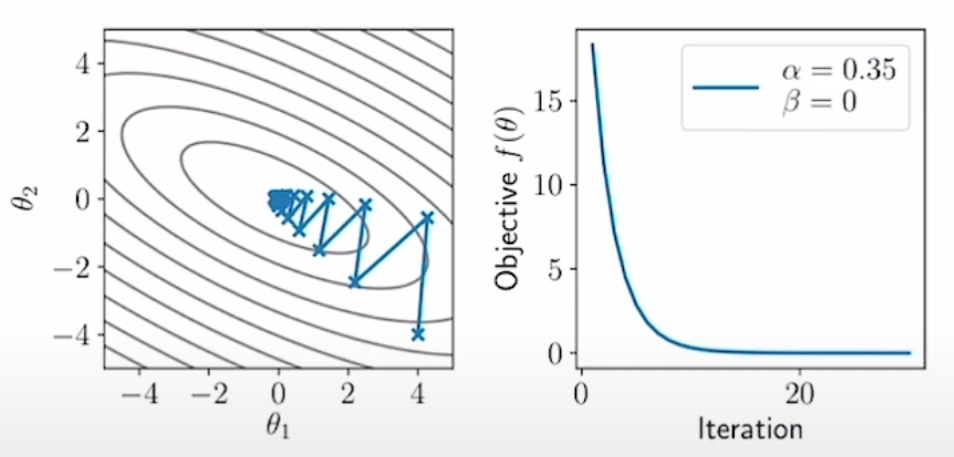
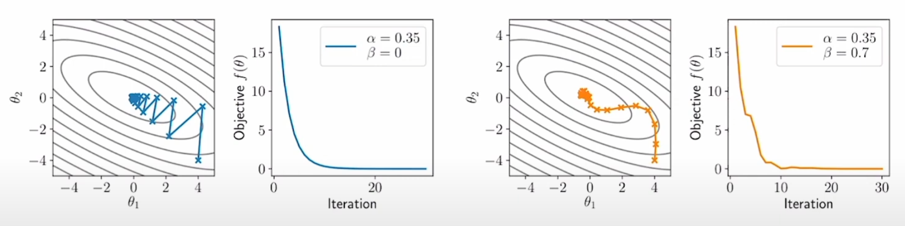
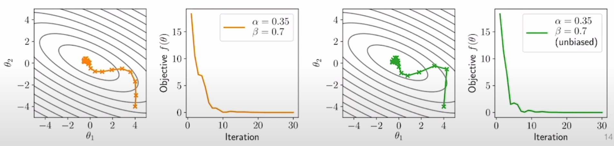
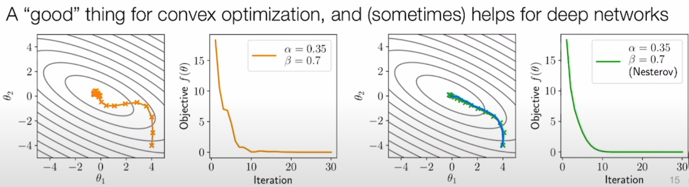
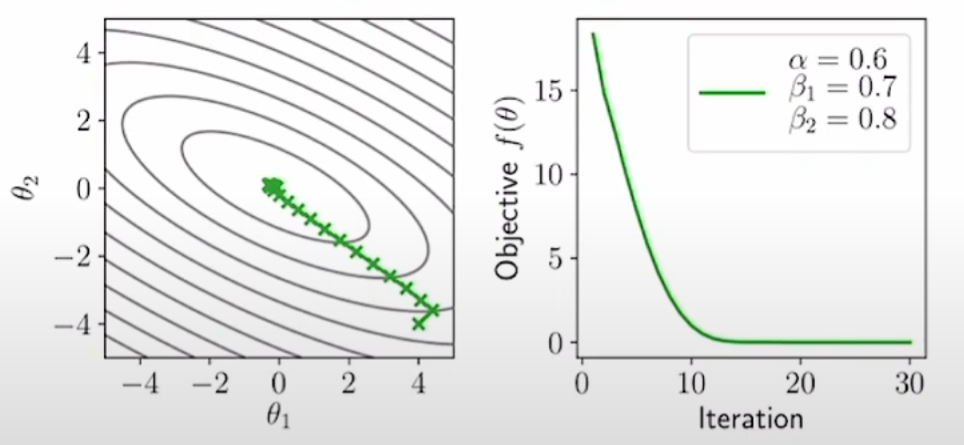
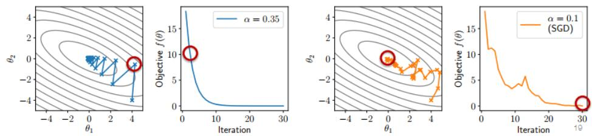
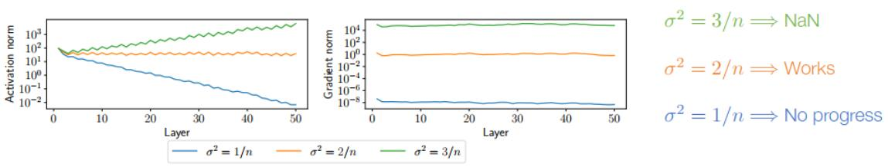

# 全连接神经网络、优化、初始化

## 全连接神经网络
- “重”定义：多层感知机（MLP）的标准定义：
  $ \begin{aligned} & z_{i+1}=\sigma_i\left(W_i^T z_i+b_i\right), \quad i=1, \ldots, L \\ & h_\theta(x) \equiv z_{L+1} \\ & z_1 \equiv x\end{aligned} $
  参数为： $ \theta=\left\{W_{1: L}, b_{1: L}\right\} $ 其中1:L为1 to L

- size：Zi = ni,Wi = ni * ni+1, bi = ni+1
- 其矩阵形式：$Z_{i+1}=\sigma_i\left(Z_i W_i+1 b_i^T\right)$ 其中 $1 b_i^T$ 意为将一个m * 1的全1向量与1 * ni+1的 $b_i^T$ 矩阵相乘
> 但是实践中不需要那么麻烦，代码通过广播进行操作，广播意为将1 * 1，n * 1的向量（或高阶张量）视为n * p矩阵进行计算（自动拓展矩阵使得计算匹配）。

- 训练一个MLP关键问题：
    1. 如何选择网络的宽度和深度？
    2. 如何优化目标？
    3. 如何初始化网络的权重？
    4. 如何确保网络可以在多次优化迭代中继续轻松训练？
   

## 优化
- 最小化关于Theta的损失函数

### 1. 梯度下降
- $\theta_{t+1}=\theta_t-\alpha \nabla_\theta f\left(\theta_t\right)$ t表示迭代次数
- 最速下降

效果：

### 2. 牛顿法
- 传统优化的正确方法，但不常用，与深度学习没有太大相关性
- 当牛顿步（学习率/步长） = 1时（<1时为阻尼牛顿法），牛顿法将一步优化二次函数，相当于用二阶泰勒展开将函数逼近为二次函数，然后求解最优解
- 总是直接趋向于最优值，而不是最速下降

### 3.动量法
- **考虑了多个先前梯度的滑动平均值**，是梯度下降与牛顿法的折中（更类似梯度下降），纯粹使用梯度项，复杂性与梯度下降相同
- 使梯度下降的趋势不只是受步长与梯度影响，还受动量这一矢量的制约，类似高楼中的阻尼铁球的作用，减小梯度下降的振幅

- **a. 普通动量法**
- $u_{t+1}=\beta u_t+(1-\beta) \nabla_\theta f\left(\theta_t\right) \\
 \theta_{t+1}=\theta_t-\alpha u_{t+1}$
 其中 $\alpha$ 和之前一样是步长，$\beta$ 是动量平均参数, u 就是之前梯度的加权累加

效果（对比梯度下降）：

- **b. 无偏动量法**：假设将初始动量项为0，则初始迭代中，$u_{0}=0 , u_{1}=\beta u_0+(1-\beta) \nabla_\theta f\left(\theta_0\right) = (1-\beta) \nabla_\theta f\left(\theta_0\right)$ 那将会使其无缘故的乘 $(1-\beta)$ 减小梯度，故为了使所有迭代中具有相同的预期幅度，有： $ \theta_{t+1}=\theta_t-\alpha u_t /\left(1-\beta^{t+1}\right)$ 
> 注意 $\beta^{t+1}$ 为指数t+1

效果（对比普通动量法）：

- **c. Nesterov动量法**：计算“下一个”点的动量更新，一个有用的技巧

效果（对比普通动量法）：

- **d. Adam自适应梯度算法**
- 对于不同的参数，梯度的比例可以有很大的不同，尤其是跨越深度网络的不同层、不同的层类型等。所谓的自适应梯度方法试图通过迭代估计这个比例，然后相应地重新调整梯度更新。Adam算法是深度学习中使用最广泛的自适应梯度方法，它结合了动量和自适应尺度估计：
$\begin{aligned}
& u_{t+1}=\beta_1 u_t+\left(1-\beta_1\right) \nabla_\theta f\left(\theta_t\right) \\
& v_{t+1}=\beta_2 v_t+\left(1-\beta_2\right)\left(\nabla_\theta f\left(\theta_t\right)\right)^2 \\
& \theta_{t+1}=\theta_t-\alpha u_{t+1} /\left(v_{t+1}^{1 / 2}+\epsilon\right)
\end{aligned}$

- Adam算法用了两个动量u和v，一个是执行普通动量法，另一个是通过平方使梯度标准化，这样就能大大减小参数规模带来的影响，而最后迭代的epsilon是为了分母不为零的微调，且需在根号之外
- 广泛使用，变式多

效果：

### 4.随机梯度下降
- 最重要的优化还是使用随机变量、小批次的SGD算法来实现梯度下降
- 对于Batch: $B \subset\{1, \ldots, m\}$ ,梯度下降如下: 
  $\theta_{t+1}=\theta_t-\frac{\alpha}{B} \sum_{i \in B} \nabla_\theta \ell\left(h\left(x^{(i)}\right), y^{(i)}\right)$
> 采取许多廉价、有噪音但无偏差的下降步骤来提高性能

效果：

## 初始化
- 如何选择Wi，bi等参数的初始值

将Wi初始化为零，则所有梯度或者Zi也都为零（非常糟糕）

### 随机初始化
- 正态分布 $W_i \sim \mathcal{N}\left(0, \sigma^2 I\right)$ 
- $\sigma^2$ 的数值会影响：
  1. 前向传播Zi的模长
  2. 反向传播梯度 $\nabla_{W_i} \ell\left(h_\theta(X), y\right)$ 的模长

对 MNIST 50层神经网络的简单测试：

- 错误思想：不管网络参数的初始化如何它们都会收敛到某个相似的点区域
> 权重通常更接近它们的初始化!

- 是什么导致了上图的影响？

考虑独立随机变量 \( x \sim \mathcal{N}(0,1) \)，\( w \sim \mathcal{N}\left(0,\frac{1}{n}\right) \)，那么：

\[
\mathbf{E}[x_i w_i] = \mathbf{E}[x_i]\mathbf{E}[w_i] = 0, \quad \text{Var}[x_i w_i] = \text{Var}[x_i]\text{Var}[w_i] = \frac{1}{n}
\]

因此 \( \mathbf{E}[w^T x] = 0 \)，\( \text{Var}[w^T x] = 1 \)，根据中心极限定理，\( w^T x \to \mathcal{N}(0,1) \)。

非正式地说，如果使用线性激活函数，并且 \( z_i \sim \mathcal{N}(0,I) \)，\( W_i \sim \mathcal{N}\left(0,\frac{1}{n}I\right) \)，那么：

\[
z_{i+1} = W_i^T z_i \sim \mathcal{N}(0,I)
\]

如果使用ReLU激活函数（不准确的估计），我们需要 \( W_i \sim \mathcal{N}\left(0,\frac{2}{n}I\right) \)。

-  如果 \( \sigma^2 \neq \frac{2}{n} \)，那么对于ReLU网络，每次迭代隐藏单元的方差都会按某个因子呈几何级数增加/减少：

\[
\text{Var}[Z_{i+1}] = \gamma \cdot \text{Var}[Z_i] = \gamma^i
\]

向前和向后传播都会发生这种情况：
\[
\text{Var}[G_i] = \gamma \cdot \text{Var}[G_{i+1}] = \gamma^{D-i}
\]

因此，梯度的方差将在层上近似恒定，但受 \( \sigma^2 \) 和深度 \( D \) 的选择的严重影响：

\[
\nabla_{W_i} l(h_\theta(X), y) \propto Z_i^T G_i \propto \gamma^D
\]

- 故初始化参数有 $\sigma^2 = \frac{2}{n}$ 的准则