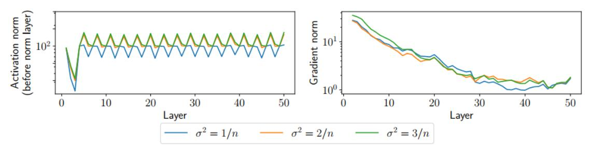

# 归一化和正则化

## 大纲
- 归一化
- 正则化
- 优化、初始化、归一化、正则化的交互

### 归一化

- 归一化为了将特征之间的差异缩小，例如特征的计量单位不同使得其差异巨大，需要通过01或Z-score归一化使其特征的数据都控制在一定范围内，便于特征与特征之间的起作用的平均
- 详细举例：身高体重两特征，一个基本在1-2（米），一个在50以上（kg），则对损失函数（例如为差平方）的优化就会偏向增大体重对应参数的权重
- 基本公式为其更新后值 = （更新前值 - 均值） / 控制非零的标准差 

> BatchNorm是对一个batch-size样本内的每个特征[分别]做归一化，LayerNorm是[分别]对每个样本的所有特征做归一化

#### 1. Layer normalization 层归一化
- 标准化（均值零和方差一）每一层的激活函数值
- $\hat{z}_{i+1} =\sigma_i\left(W_i^T z_i+b_i\right) \\ \\
z_{i+1}  =\frac{\hat{z}_{i+1}-\mathbf{E}\left[\hat{z}_{i+1}\right]}{\left(\mathbf{V a r}\left[\hat{z}_{i+1}\right]+\epsilon\right)^{1 / 2}}$

- 可以认为是在得出激活值后又加了一层标准化层（$\hat{z}_{i+1}$ 为中间值）

- 其能“修复”lecture6中随机初始化的不同层激活范数或梯度根据初始化变化而变化（变NaN或0）的问题，效果如下图：

- 但层归一化会对梯度下降带来一些影响，原因可能是其对数据的均值与方差作了强制改变，而原均值与方差中包含的信息消失，故较难训练

#### 2. Batch normalization 批归一化

- 对于层归一化，可以理解成输入的m * n批矩阵每个样本内特征作标准化，为每一行，而batchnorm为每一列，即同一类特征标准化

- 其特点是对于每个特征的归一化都依赖于整个批次，需对批次动态求平均值与方差 $\hat{\mu}_{i+1}, \hat{\sigma}_{i+1}^2$
- 归一化公式： $\left(z_{i+1}\right)_j=\frac{\left(\hat{z}_{i+1}\right)_j-\left(\hat{\mu}_{i+1}\right)_j}{\left(\left(\hat{\sigma}_{i+1}^2\right)_j+\epsilon\right)^{1 / 2}}$ 

### 正则化

- 深度网络基本上都是过度参数化，即参数数量多于训练样本数量，故其容易拟合训练数据但难以泛化，正则化的目的就是限制函数过拟合
- 隐式正则化指我们现有的算法（SGD等）或架构中已经限制函数复杂性的方式
- 显式正则化可理解为是在训练过程中加入正则化层（在此讨论）

#### L2正则化a.k.a权重衰减
- **为什么需使模型参数尽可能小**：深度神经网络中如果参数越大，模型对输入数据的细微变化可能越敏感，进而过度拟合训练数据中的噪声或异常值；而较小的参数会使输出更加平滑，更具有鲁棒性
- **怎么做**：改变需优化的函数，在其中添加一项权重平方和（即所有参数的所有维度的平方再求和），使更新梯度时连带限制参数过大
$$
\text{minimize}_{W_{i:D}} \frac{1}{m} \sum_{i=1}^m \ell \left( h_{W_{i:D}}(x^{(i)}), y^{(i)} \right) + \frac{\lambda}{2} \sum_{i=1}^D \| W_i \|_2^2
$$
($\lambda$ (lambda)为正则化参数)

  > 为什么是 $\frac{\lambda}{2}$ 因为
   $\frac{\lambda}{2} \sum_{i=1}^D \| W_i \|_2^2$ 对Wi求导为2 * Wi，求导结果为 ${\lambda} W_i$

  而后求偏导、梯度下降更新的公式为：
  $$
  W_i:=W_i-\alpha \nabla_{W_i} \ell(h(X), y)-\alpha \lambda W_i=(1-\alpha \lambda) W_i-\alpha \nabla_{W_i} \ell(h(X), y)
  $$

这相当于在每次更新前先将权重缩小 $(1-\alpha \lambda)$ 倍，逐步抑制过大的参数

- L2正则化项优点：平方和为凸函数，相比L1，其连续平滑，比L3..计算简单高效

  不足：参数向量的模长大小可能无法很好地代表深度网络的复杂性

#### Dropout正则化方法
- 另一种常见的正则化策略，常在训练时使用，将每层的部分激活值随机设置为零
- **原理**：1. Dropout使神经元不依赖特定其他神经元的存在，举例：如果某个特征只能由神经元A检测，而A被丢弃时，网络在该步骤中将无法正确预测，导致损失增大。为了减少这种风险，网络会迫使多个神经元学习同一特征（冗余表示），即使部分神经元被干扰或输入数据存在噪声，其他神经元仍能提供有效信号
  2. 可理解为每次训练时，Dropout随机生成一个子网络，相当于对多个子模型进行集成，可提升泛化能力
- 加一层正则化层，输入为：
  $$
\hat{z}_{i+1}  =\sigma_i\left(W_i^T z_i+b_i\right) \\
  $$
  输出为：
  $$
\left(z_{i+1}\right)_j  =\left\{\begin{array}{cl}
\left(\hat{z}_{i+1}\right)_j /(1-p)  \text { with probability } 1-p \\
0  \text { with probability } p
\end{array}\right.
  $$

> 为什么要除以(1-p)，因为需保持测试时（测试时所有的神经元都参与计算）与训练时（dropout概率置零）期望相同，所以按为零的概率缩放激活值是必要的，这样求应用dropout后激活值的期望时两种情况分别乘上对应概率算出来期望还是 $\hat{z}_{i+1}$

- 与SGD的相似之处：
  SGD为随机取批次来训练：
  $$
 \frac{1}{m} \sum_{i=1}^m \ell\left(h\left(x^{(i)}\right), y^{(i)}\right) \Longrightarrow \frac{1}{|B|} \sum_{i \in B} \ell\left(h\left(x^{(i)}\right), y^{(i)}\right)
  $$
  Dropout为随机取子网络（随机丢弃神经元）来训练：（单数据）
  $$
 z_{i+1}=\sigma_i\left(\sum_{j=1}^n W_{:, j}\left(z_i\right)_j\right) \Longrightarrow z_{i+1}=\sigma_i\left(\frac{n}{|\mathcal{P}|} \sum_{j \in \mathcal{P}}^n W_{:, j}\left(z_i\right)_j\right)
  $$

  p为留下的神经元集（不为零的维度），j为维度下标（1~n），为什么要乘 $\frac{n}{|\mathcal{P}|}$ ，因为保留的神经元概率为 $\frac{|\mathcal{P}|}{n}$ ，要保持总和期望一致，故需先乘n/P放大留下的子集，补偿因丢弃神经元导致的信号损失

### 优化、初始化、归一化、正则化的交互

许多框架的设计选择旨在简化深度网络的优化能力：
- 优化器学习率/动量的选择
- 权重初始化的选择
- 归一化层的选择
- 正则化方式的选择
- ..

这一部分的讲解大意为，深度学习的研究带有一定性质的类似炼金术的随机性，人们并没有全面了解这些不同的经验技巧（例如Batchnorm）是如何真正起作用和相互作用的，但在理解如何调整架构之后就可以以较优势的方法组合以提高性能
