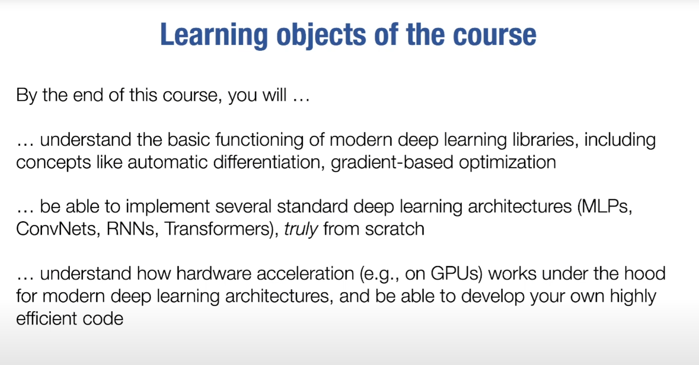

# 大纲
- 课程目标
- 研究DL的目的

# 议题
- ML复习/背景、自动微分、全连接网络、优化、NN库、卷积神经网络、硬件和GPU加速、序列模型、训练大型模型、transformers + attention、生成模型

- **ML/DL区别**：ML需要人工提取特征给机器学习，而深度学习基于多层神经网络自行分离特征并学习之

**课程收获大概**

# 参考文章/博客
- https://juejin.cn/post/7416848881407098918
- https://juejin.cn/column/7229861468660514853
- https://github.com/careywyr/dlsyscourse
- https://www.zhouxin.space/notes/notes-on-cmu-10-414-deep-learning-system/
- https://doraemonzzz.com/tags/%E6%B7%B1%E5%BA%A6%E5%AD%A6%E4%B9%A0%E7%B3%BB%E7%BB%9F/
- https://blog.csdn.net/wxj1yx?type=blog

