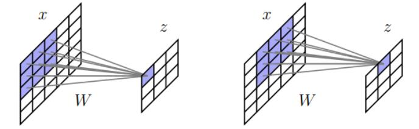
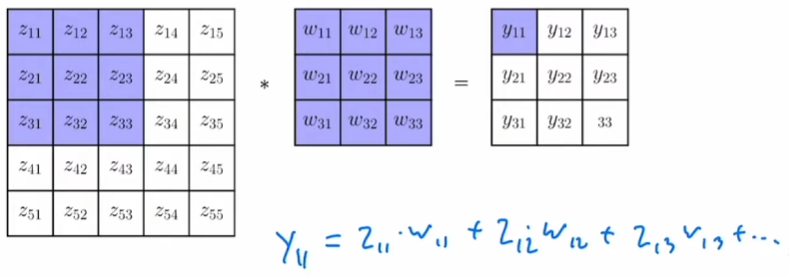
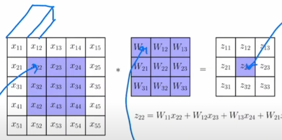
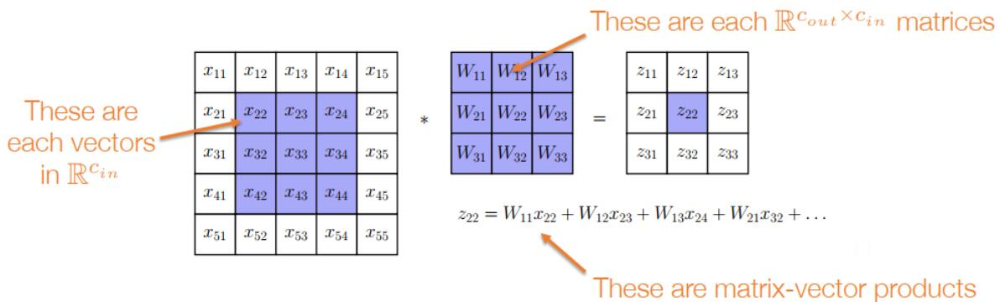
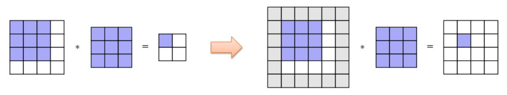
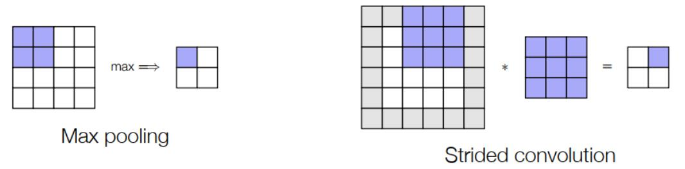
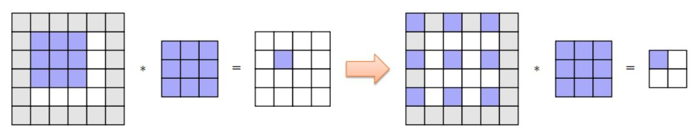
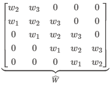
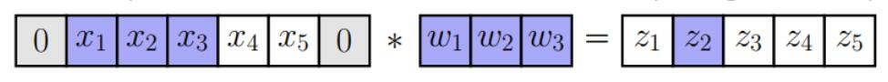

# 卷积神经网络

## 大纲
- 何为卷积算子，怎么在深度网络中实现之
- 怎么将其结合进自动微分工具中

### 卷积算子
- 问题：
  1. 针对图像输入，原MNIST将28*28的黑白图像输入为一个长度为784的向量，但其不具备可拓展性（256*256像素的RGB（红绿蓝三色）图片就要长度为65536*3=196,608长度向量，再乘以神经元个数（特征维度）就是天文数字的参数个数）
  2. 将原图平移一个像素的位置会导致后面隐藏层几乎完全改变，但实际上仍是同一个图像
- 卷积方法则很好的解决此问题：
  
   - 其将隐藏层本身视为图像，其元素仅与输入图像的局部联系
   - 且将图像压缩为隐藏层的过程函数的参数都一致为W，举例：上文256*256像素的RGB（红绿蓝三色）图片若使用原始方法将其转化成隐藏层（假设有1000个神经元）则需要65536*3*1000个参数，而使用上图的卷积则只需九个参数

  

  z为原图像，w为参数集，y为隐藏层

- **深度网络中的多通道卷积**
  - 其将上文中的每一个量从标量转换成长度为通道数的向量
  - 即下图：
  
  长方体的长度为通道数（特征数），其中运算为矩阵（向量）运算。
  矩阵（向量）维度：
  
  - 但是每个量从标量转换成一维向量后还需要维度来表示其位置关系，故有：
    1. $x \in \mathbb{R}^{h \times w \times c_{i n}}$ 
    2. $z \in \mathbb{R}^{h \times w \times c_{\text {out }}}$ 
    3. $W \in \mathbb{R}^{c_{i n} \times c_{\text {out }} \times k \times k}$ 
    > h*w为图像尺寸，cin，cout为层输入层输出的通道数（特征数），k为W参数的矩阵大小（在这里为k * k）

### 卷积在深度网络中的实践须知

1. 问题：上述的卷积示例图片中使用3*3的参数，使得隐藏层的图像大小小于原图像
   实践中解决：将原图像扩大（填零）至其卷积后的隐藏层图像大小与扩大前原图像相等，再进行卷积
   - 对于（奇数）内核大小k，在所有边上用(k-1)/2个零填充输入，导致输出与输入大小相同。
   - 还有平均值填充等

   
   其中灰色为填零处

2. 目的：降低特征图的尺寸，减少计算量
   > 特征图：特征图是卷积操作的输出结果，每个特征图对应输入数据的一个特定特征维度，表示其学习到的输入数据的某种抽象特征（如边缘、纹理、形状等）

   方法：
   1. 池化（Pooling）
   - 池化通过在局部区域内聚合信息（取最大值Max Pooling或平均值Average Pooling），实现特征图的降维，同时保留重要特征
   - 计算效率十分高，仅有聚合操作
   - 局限性：丢弃了部分空间信息（尤其是非最大值区域）；可能导致部分细节丢失，影响对小目标的检测
   
   2. 步长卷积（Strided Convolutions）
   - 通过增大卷积核的滑动步长（Stride）（卷积核每次滑动的像素数），直接减少特征图的尺寸，同时完成特征提取与降维
   - 可以理解为加速滑动卷积核
   - 与池化相比可以保存更多空间信息
   - 局限性：若步长过大，可能导致信息跳跃式丢失；需谨慎设计步长与填充（Padding）以控制输出尺寸
   
   图示化：
   

3. 分组卷积
  - 问题：输入/输出通道增多时，滤波器W仍会有大量参数，可能导致过度拟合/计算缓慢
  - 普通卷积的每个输出通道都由所有输入通道卷积得到，计算量过大
  - 分组卷积通过将输入和输出通道划分为多个独立的组，每组内部进行独立的卷积运算，组间无交互
  - 优势：
    1. 参数量和计算量均减少为原来的 1/G（组数），适合轻量化模型
    2. 不同组可以学习不同特征
    3. 组间天然并行，便于多GPU或多核设备加速

4. 扩张（Dilation）
  - 定义 **感受野**：滤波器W在原图像中的覆盖，即特征层某神经元能映射到原始输入图像的空间范围
  

  - 举例上图，原本卷积的特征层单个像素对应原图像的感受野较小，而扩张之后范围变大，但也不能过大，过大的感受野可能引入无关背景噪声，降低定位精度
  - 注意：如果要获取相同大小的特征图需要添加更多填充

### 融入进自动微分工具中
- 把卷积作为一个运算符来实现，将卷积方法当成一个大的矩阵乘法来看（但实际上没有，从概念上方便理解）
- 首先理解滤波器W（上图为例）形象上是一个3*3的矩阵，但是在自动微分中是一个
  

  这样的矩阵，这样与输入层原图像才可以进行矩阵乘法

- 而反向求卷积运算的梯度 $\frac{\partial L}{\partial W}$ ,$\frac{\partial L}{\partial x}$ ，即求 $\bar{v} \frac{\partial \operatorname{conv}(x, W)}{\partial W}, \quad \bar{v} \frac{\partial \operatorname{conv}(x, W)}{\partial x}$ (这里的 $\bar{v}$ 是伴随)

- 再理解如果前向传递乘以运算符W，那么后向传递就必须乘以它的转置W^T（确保链式法则运算维度匹配）

- 而卷积这一算法在前面可以把他同样理解为矩阵乘法，故其偏导方法也是和自动微分类似，但因为x与W不可兼得（总要有个转置）故要用两个方法求之（仅用1维卷积举例）：
  1. 求 $\frac{\partial L}{\partial x}$
  
  如上图，需用矩阵运算的形式等效表示上图的卷积运算
   - 矩阵构造：  
将卷积核的滑动过程编码为矩阵 `Ŵ`，每行对应一个输出位置的权重组合：
\[
\widehat{W} = 
\begin{bmatrix}
w_2 & w_3 & 0 & 0 & 0 \\
w_1 & w_2 & w_3 & 0 & 0 \\
0 & w_1 & w_2 & w_3 & 0 \\
0 & 0 & w_1 & w_2 & w_3 \\
0 & 0 & 0 & w_1 & w_2 \\
\end{bmatrix}
\]
   - 得公式为 $ z = \widehat W x$
   - 而反向传播中有 $\widehat{W}^T=\left[\begin{array}{ccccc}
w_2 & w_1 & 0 & 0 & 0 \\
w_3 & w_2 & w_1 & 0 & 0 \\
0 & w_3 & w_2 & w_1 & 0 \\
0 & 0 & w_3 & w_2 & w_1 \\
0 & 0 & 0 & w_3 & w_2
\end{array}\right]$
     相当于将原本卷积的滤波器W翻转了一下，而且最后算 $\bar{v} \frac{\partial \operatorname{conv}(x, W)}{\partial x} = \bar{v} \widehat{W}^T$ 时，也等价于将 $\bar{v}$ 直接和翻转后的滤波器作卷积即可！
  

  1. 求 $\frac{\partial L}{\partial W}$
     - 同理公式为 $\left[\begin{array}{c}
z_1 \\
z_2 \\
z_3 \\
z_4 \\
z_5
\end{array}\right]=x * w  (卷积计算)=\left[\begin{array}{ccc}
0 & x_1 & x_2 \\
x_1 & x_2 & x_3 \\
x_2 & x_3 & x_4 \\
x_3 & x_4 & x_5 \\
x_4 & x_5 & 0
\end{array}\right]\left[\begin{array}{l}
w_1 \\
w_2 \\
w_3
\end{array}\right](矩阵计算)$

       > 但是注意这时候的x是输入而不是滤波器，所以反向时伴随 $\bar{v}$ 需要乘以这个基于 $x$ 的矩阵的转置，不能看作滤波器翻转之类（虽然这个x矩阵较多重复部分占用内存，但很有用高效 “见未来关于 im2col 操作的讲座” ）

？？？
