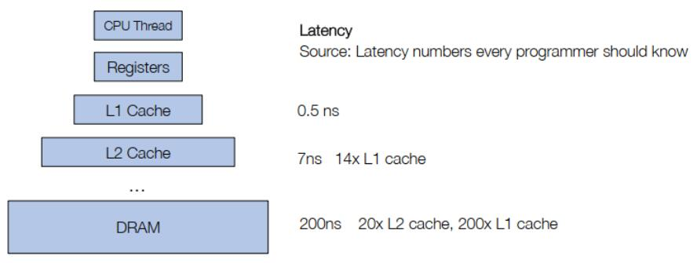
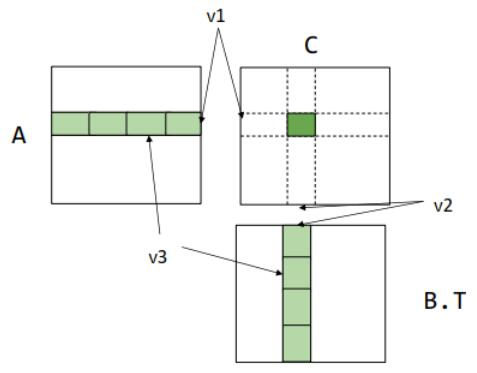
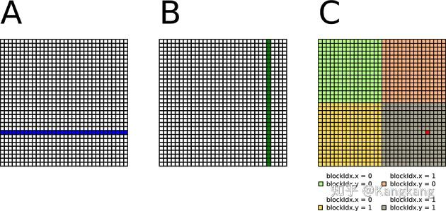

# 硬件加速

## 大纲
- 一般的加速技术
- 举例学习：矩阵乘法

### 一般的加速技术

#### 1. 向量化
- 问题：相加两个长度为256的数组
- for i in (0,256)费时，从而用向量化四个浮点数为一组来相加
```c++
void vecadd(float* A, float *B, float* C) {
    for (int i = 0; i < 64; ++i) {
        float4 a = load_float4(A + i*4); //load_float4：从内存中连续加载 4 个 float 到 float4 类型的变量
        float4 b = load_float4(B + i*4);
        float4 c = add_float4(a, b); //add_float4：对两个 float4 向量进行逐元素加法
        store_float4(C + i* 4, c); //store_float4：将 float4 向量 c 的 4 个元素写回内存的连续位置
    }
}
```
- float4 是一个 SIMD（单指令多数据）向量类型，通常对应 CPU/GPU 的 128 位寄存器，上代码中 4 个加法操作在一条指令内完成，可显著提升性能
> 附加要求：内存（A、B、C）需要对齐到128位
> 
> 原因：float4 类型由4个32位浮点数组成，总大小为 4×4字节 = 16字节 = 128位。如果内存地址未对齐到128位（例如地址是 0x1001 而不是 0x1000），则无法直接使用高效的 对齐加载/存储指令（如 _mm_load_ps），而必须使用性能较低的 非对齐指令（如 _mm_loadu_ps）
>
> 对齐内存：SIMD指令可以一次性从内存中加载/存储完整的128位数据，占用1个CPU周期。
> 
> 非对齐内存：硬件可能需要拆分内存访问为多次操作（例如先读低地址部分，再读高地址部分），导致额外开销。


#### 2. 数据布局和步长
- 问题：如何在内存中存储一个矩阵

- 三种方式：
  1. Row major（行主导）：A[i, j] => Adata[i * A.shape[1] + j]
  2. Column major（列主导）：A[i, j] => Adata[j * A.shape[0] + i]
  3. Strides format（步长格式）：A[i, j] => Adata[i * A.strides[0] + j * A.strides[1]]（i * A.strides[0]：在第 0 维度（行） 移动 i 步时，跨越的字节数；j * A.strides[1]：在第 1 维度（列） 移动 j 步时，跨越的字节数。）
   > Strides format的优势：**更通用** 允许数组按 行优先、列优先 或其他非连续方式存储；切片、重塑（Reshape）等操作仅需调整步幅，无需修改底层数据（零拷贝）（举例矩阵转置只需要交换strides[0]，strides[1]位置）
   > 
   > 缺陷：**内存访问变得不连续** 使向量化更难；许多线性代数运算需要紧凑的数组，所以可能需要先压缩数组

#### 3. 并行化

```c++
void vecadd(float* A, float *B, float* C) {
    #pragma omp parallel for
    // OpenMP并行化指令
    // 作用：将 for 循环分配到多个线程并行执行
    // 要求：循环迭代之间必须 无数据竞争（每个线程处理不同的 i 值）
    for (int i = 0; i < 64; ++i) {
        float4 a = load_float4(A + i*4);
        float4 b = load_float4(B + i*4);
        float4 c = add_float4(a, b);
        store_float4(C * 4, c);
    }
}
```


### 矩阵乘法
#### CPU上的内存层次结构


- 缓存中的数据交换比DRAM（主存）中快很多，右边为各需时间

#### 原始代码
- $C=A B^T$
```c++
float A[n][n], B[n][n], C[n][n];

for (int i = 0; i < n; ++i) {
    for (int j = 0; j < n; ++j) {
        C[i][j] = 0;
        for (int k = 0; k < n; ++k) {
            C[i][j] += A[i][k] * B[j][k];
        }
    }
}
```

```c++
dram float A[n][n], B[n][n], C[n][n];
for (int i = 0; i < n; ++i) {
    for (int j = 0; j < n; ++j) {
        register float c = 0;
        for (int k = 0; k < n; ++k) {
            register float a = A[i][k];
            register float b = B[j][k];
            c += a * b;
        }
        C[i][j] = c;
    }
}
```
- 第二个代码就是将变量放在寄存器而不是主存中，但时间耗费几乎差不多
  - 总的主存访问时间：$2\times \mathrm{dramspeed} \times n^3$
  - 使用的寄存器数量：3

#### Register Tiled矩阵乘法
- **其反映了主存与寄存器之间的关系**





- 理解：把矩阵分块再各块相乘，上图中v1代表A中小块的宽度，v2代表B.T中小块的长度

- 代码：
  ```c++
  dram float A[n/v1][n/v3][v1][v3];  //A矩阵前两个[n/v1][n/v3]是块索引，后面[v1][v3]是块内元素索引，A中块大小为v1*v3
  dram float B[n/v2][n/v3][v2][v3];
  dram float C[n/v1][n/v2][v1][v2];
  
  for (int i = 0; i < n/v1; ++i) {
      for (int j = 0; j < n/v2; ++j) {  // 遍历c中行列块
          register float c[v1][v2] = 0; // 寄存器中暂存c中子块
          for (int k = 0; k < n/v3; ++k) {
              register float a[v1][v3] = A[i][k]; // 访问一次主存把A中一子块copy过来
              register float b[v2][v3] = B[j][k];
              c += dot(a, b.T); // 块操作（相乘）
          }
          C[i][j] = c; // 将寄存器计算后的存回去主存
      }
  }
  ```

- 优势：通过分块减少访问主存次数，提升缓存命中率
- 一些数据比较：
  - A的访问主存时间：$n/v_1 \times n/v_2 \times n/ v_3 \times v_1\times v_3=n^3/ v_2$ (三个循环迭代时间乘积*大小为v1 * v3A子块copy进缓存时间)
  - B的访问主存时间：$n/v_1 \times n/v_2 \times n/ v_3 \times v_2\times v_3=n^3/v_1$ 
  - 总的主存访问时间：$\mathrm{dramspeed} \times (n^3/ v_2 + n^3/ v_1)$
  - 使用的寄存器数量：$v_1\times v_3+ v_2\times v_3 + v_1\times v_2$
  > 发现时间和v3无关，寄存器数量和v3有关，故v3一般设为最小1


#### 进一步考虑cache line（缓存行）的tiling
- **考虑主存与缓存的关系**

- 将v3设为1（原因如上），代码如下：
```c++
dram float A[n/b1][b1][n];
dram float B[n/b2][b2][n];
dram float C[n/b1][n/b2][b1][b2];

for (int i = 0; i < n/b1; ++i) {
    l1cache float a[b1][n] = A[i]; // 将 A 的第 i 个块加载到 L1 缓存
    for (int j = 0; j < n/b2; ++j) {
        l1cache b[b2][n] = B[j]; // 将 B 的第 j 个块加载到 L1 缓存
        C[i][j] = dot(a, b.T); // 计算子块乘法并写入 C
    }
}
```

> **关于缓存行的匹配**：缓存行（Cache Line）的大小对系统性能的影响是**时空权衡**（Time-Space Tradeoff） 问题，缓存与主存之间的数据交换是以缓存行（块）为单位的（是因为系统认为调用某数据时有很大概率会调用其相邻、附近数据，举例：数组调用），所以当块大时对调用近的数据友好而块的交换就慢了，反之块小交换快但可能命中率会下降
>
> 而矩阵一般都是行优先储存，故矩阵乘法如果按列访问大概率会跨缓存行（一个较大的缓存行64字节=16个float数，小缓存行16字节），这样效率十分低，故行储存尽量以行访问，或者列访问使用小缓存行


#### 综合
- 因为如上图CPU上的内存层次结构分层，故为了尽可能的**内存重用**，矩阵乘法的分块也可以遵循此规则，即先将矩阵分成行块存入l1缓存(or..)，再将行块分成子行块放入寄存器中，尽可能的减少访问远的主存的次数

- 代码：
```c++
dram float A[n/b1][b1/v1][n][v1];
// 第一级分块：将矩阵 A 划分为 n/b1 个 行块，每个行块大小为 b1×n
// 第二级分块：每个行块进一步划分为 b1/v1 个 子行块，每个子行块大小为 v1×n
dram float B[n/b2][b2/v2][n][v2];
// ..

for (int i = 0; i < n/b1; ++i) { // 遍历 A 的一级行块
    l1cache float a[b1/v1][n][v1] = A[i]; // 加载 A 的第 i 个一级行块到 L1 缓存
    for (int j = 0; j < n/b2; ++j) { // 遍历 B 的一级行块
        l1cache b[b2/v2][n][v2] = B[j]; // 加载 B 的第 j 个一级行块到 L1 缓存
        for (int x = 0; x < b1/v1; ++x) { // 遍历 A 的二级子行块
            for (int y = 0; y < b2/v2; ++y) { // 遍历 B 的二级子行块
                register float c[v1][v2] = 0;
                for (int k = 0; k < n; ++k) {
                    register float ar[v1] = a[x][k][:]; // 从 L1 缓存加载 A 的子行块到寄存器
                    register float br[v2] = b[y][k][:];
                    C += dot(ar, br.T);
                }
            }
        }
    }
}
```
- 数据交换时间：$\mathrm{l1缓存speed}\times (n^3/ v_2 + n^3 / v_1) + \mathrm{DRAMspeed} \times (n^2 + n^3 / b_1)$

#### 关键思想：内存加载重用
- 重用示例：
```c++
float A[n][n];
float B[n][n];
float C[n][n];

C[i][j] = sum(A[i][k] * B[j][k], axis=k)
```
- 在如上代码中A的访问与j无关，故假设对j分x个组，则A/A[i][k]就能重用x次

#### 在卷积中的重用模式
```c++
float Input[n][ci][h][w];
float Weight[co][ci][K][K];
float Output[n][co][h][w];

Output[b][co][y][x] = sum(Input[b][k][y+ry][x+rx] * Weight[co][k][ry][rx], axis=[k, ry, rx]) 
// 对输入通道 k 和卷积核位置 (ry, rx) 进行遍历，将所有乘积结果累加
```

- 详细流程：
  1. 遍历每个样本（b循环）
  2. 遍历每个输出通道（co循环）
  3. 遍历输出空间的每个位置（y和x循环）
  4. 对每个[y][x]：在输入张量中以 [y][x] 为中心的K * K窗口与K * K卷积核相乘后累加


#### 还可优化的地方（课未提及）
- 循环顺序调整：将列访问（不连续访问）放在循环尽量最内部（将循环顺序改为 i-k-j），保证循环最底部的运算中下标访问尽量连续（使不连续的变量数降到最少）

- 示例：
```c++
for (int i = 0; i < n; i++) {
    for (int k = 0; k < n; k++) { // 优先遍历连续内存
        for (int j = 0; j < n; j++) {
            C[i][j] += A[i][k] * B[j][k];
        }
    }
}
```
