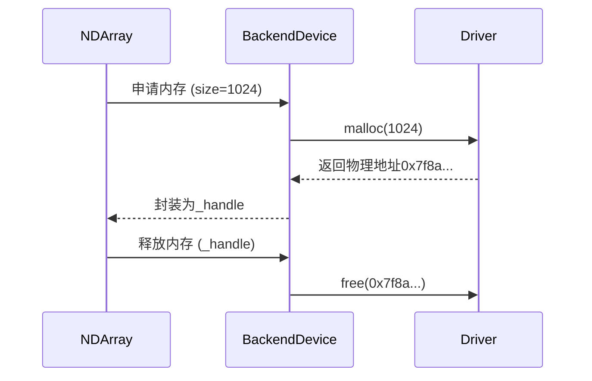
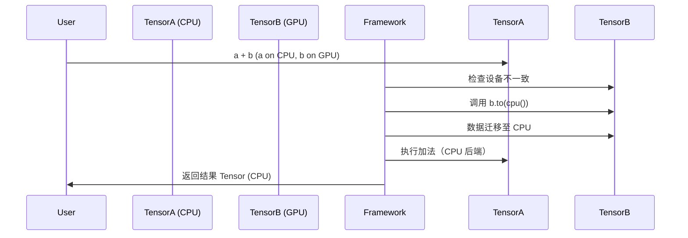
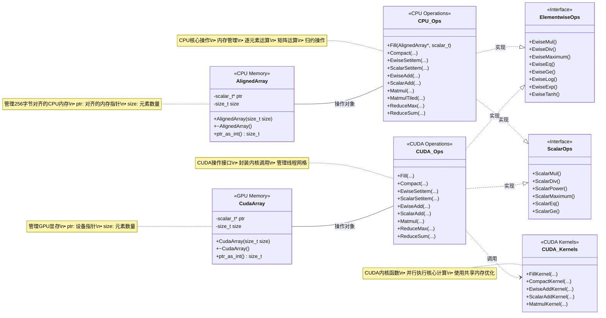

# 硬件加速实现

### needle类层次图

```
Object
├─ Op
│  ├─ TensorOp       (处理 Tensor 输出的操作，如 EWiseAdd, Transpose)
│  └─ TensorTupleOp  (处理 TensorTuple 输出的操作，如 make_tuple)
└─ Value
   ├─ TensorTuple    (张量元组，继承 Value 的计算图逻辑)
   │  ├── __len__, __getitem__, tuple() 等元组操作
   │  └─ detach()     (创建脱离计算图的副本)
   └─ Tensor         (核心张量类，继承 Value 并扩展张量功能)
      ├── 构造函数 __init__ 和工厂方法（make_from_op, make_const）
      ├── 张量属性（shape, dtype, device, data）
      ├── 运算符重载（+, *, @, sum, reshape 等，对应 TensorOp）
      ├── 反向传播（backward 方法，触发梯度计算）
      └─ 数据交互（numpy(), detach(), realize_cached_data()）
```

### 后端设备类
- 为了在cpu、gpu中用其适配的数组结构，尽可能提高计算效率，设计了ndarray、backenddevice、device、ndarray_backend_cpu、ndarray_backend_cuda这些类
- 首先ndarray就是用来封装可能的三个后端类的：numpy数组，cpu数组，cuda数组，其中通过device属性的不同来选择后端的类型(device类和backenddevice类是用两个类来管理后端设备，device类是提供给用户的接口，而调用backenddevice类去找相应的后端设备类的方法计算)
- 每个tensor(value)对象拥有device属性，标明数据所在的设备（如 cpu()、cuda()）,通过 Tensor.device 访问，返回 BackendDevice 实例
- 数据的存储：张量（value）的实际数据存储在 cached_data 中，其类型由后端决定（如 numpy.ndarray 或 CUDA 数组），cache_data里面就是NDarray类，通过device属性来调用各设备方法，如下图：



- 代码示例：
```python
a = Tensor([1, 2], device=cpu())  # 数据存储在 CPU
b = Tensor([3, 4], device=cuda()) # 数据存储在 GPU（需 CUDA 后端支持）
```
```c++
def cuda():
    """Return cuda device"""
    try:
        from . import ndarray_backend_cuda

        return BackendDevice("cuda", ndarray_backend_cuda)
    except ImportError:
        return BackendDevice("cuda", None)

def cpu_numpy():
    """Return numpy device"""
    return BackendDevice("cpu_numpy", ndarray_backend_numpy)

def cpu():
    """Return cpu device"""
    return BackendDevice("cpu", ndarray_backend_cpu)
```
- `BackendDevice` 类的职责：
  - 封装设备特定的计算逻辑（如 `cpu_numpy` 与 `cuda` 后端），所有设备相关操作（如内存分配、计算）通过 `BackendDevice.mod` 调用，这个mod就是三个后端的方法类，类似
  - 示例：
    ```python
    class BackendDevice:
        def __init__(self, name, mod):
            self.name = name  # 如 "cuda"
            self.mod = mod    # 指向具体后端模块（如 ndarray_backend_cuda）

        def ewise_add(self, a, b, out):
            self.mod.ewise_add(a, b, out)  # 调用设备对应的加法实现
    ```


- 当进行跨设备运算时（如 CPU 张量 + GPU 张量），系统会自动统一设备：
  若设备不一致 → **自动迁移数据到目标设备**(默认目标设备为第一个输入张量的设备)(调用 `Tensor.to(device)` 方法复制数据到目标设备)，例如梯度计算一定要一致
- 举例：
  - **隐式迁移**：
  ```python
  def __add__(self, other):
      # 自动将 `other` 迁移到当前张量的设备
      if self.device != other.device:
          other = other.to(self.device)
      return needle.ops.EWiseAdd()(self, other)
  ```
  调用 `Tensor.to(device)` 方法复制数据到目标设备。

  - **显式迁移**：
  用户可手动调用`Tensor.to(device)`：
  ```python
  a_gpu = a.to(cuda())  # 显式迁移到 GPU
  ```

### 设备迁移流程图


- **关键点**：
  1. **统一设备**：操作前自动对齐设备
  2. **数据中转**：通过 NumPy 实现跨后端数据传输
  3. **梯度一致性**：反向传播时确保梯度与原数据同设备

### `_array_from_numpy` 方法：
  - 根据目标设备选择后端 API 创建数据：
    ```python
    @staticmethod
    def _array_from_numpy(numpy_array, device, dtype):
        if device == cpu():
            return numpy.array(numpy_array, dtype=dtype)        # CPU 使用 NumPy
        elif device == cuda():
            return cuda_backend.array(numpy_array, dtype=dtype) # GPU 使用 CUDA 后端
    ```


---

### CPU与GPU的后端函数调用图


## 拓展方法
- 可以直接在各后端的文件中添加方法（CUDA_Ops、CPU_Ops等）
- 添加方法后可以重启内核使添加的方法生效，也可以新建一个test.py文件调用测试

