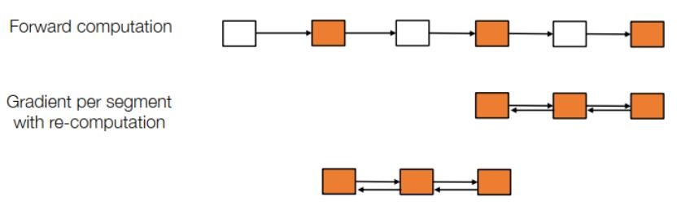
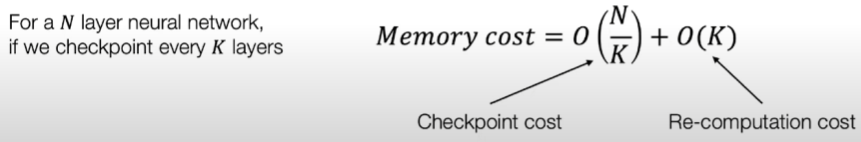
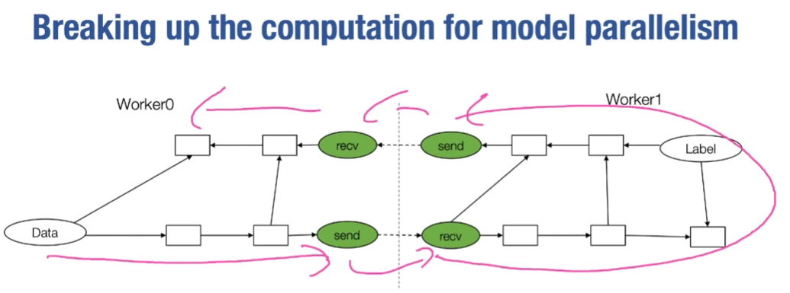
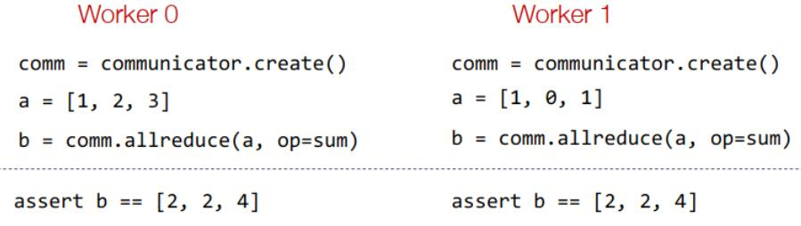
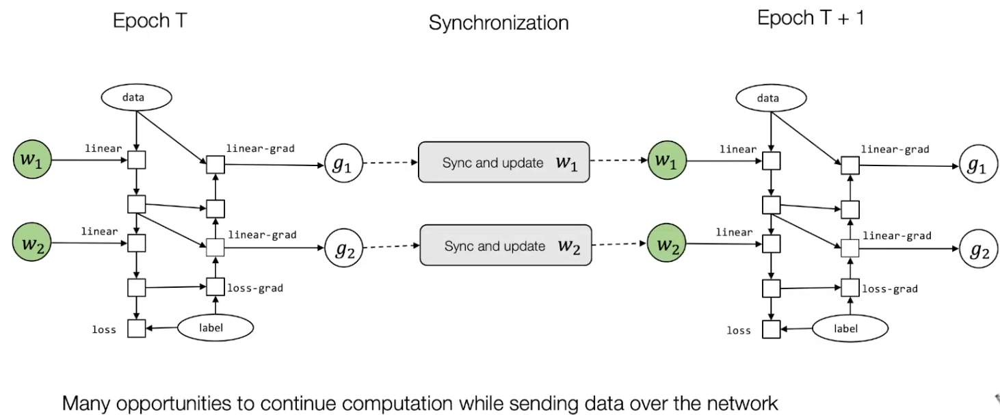
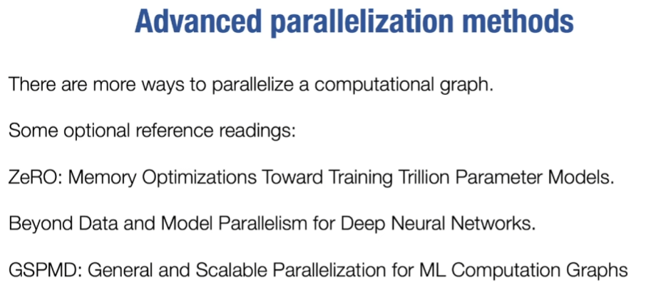

# 如何训练大模型

## 大纲
- 如何构建更深层的神经网络并放在有限的GPU内存中（内存节省技术）
- 并行和分布式训练

## 内存节省技术

### 为什么
- 机器学习系统的要素：数据、模型、计算
- 更大的数据集需要更大的模型容量、更强的计算设备，减少内存消耗后可以将更大的模型放入单个设备中

### 内存消耗来源
- 模型权重W
- 优化器状态（动量值等）
- 中间激活层的值（需保证前向传播完成）

### 节省技术
- 先考虑推理情况（前向传播），保存激活层的内存只需要两块，分别用来保存一层的输入和输出，以此类推
- 但在训练中，训练n层神经网络需要O(n)内存，因为计算梯度时需要该层输入，O(n) too cost

#### Activation checkpointing检查点技术

- 橙色为保存的激活值，空白为不报存
- 在前向传播时每个一个（几个）激活值就少存储一个前向传播的激活值，在需要求梯度（伴随值）的时候再重新求之

- 为什么可以减少内存使用？
  
  因为当求梯度中计算一些前向传播的未保存的部分时，求完梯度之后的重新计算部分中除第一个激活值外的激活值就不再被需要，故可以降低平均的内存使用

- 每K个激活值少存一个，得出内存使用的情况如上图
> 会发现当取 $K=\sqrt N$ 时，内存使用最小，为 $O(\sqrt N)$ ；但实际上不会强求 $K=\sqrt N$ 因为层与层之间的重新计算代价不同，尽量挑选重新计算成本低的激活值重新计算

- 但是会多花20%-25%的时间
- 被称为 亚线性内存成本节省算法 ，可以在有限的GPU内存上训练一个更深的模型

## 并行和分布式训练
### 计算图划分 & 管道并行

- 如上图所示，一个模型被若干worker划分，并通过通讯协议在worker中间传递数据
- 但这好像只体现在减少了存储压力，在时间上并没有并行--管道并行可以使其按时间并行，主要方法是每个worker分配若干个minibatch管道，当时间戳=0时worker0计算管道0，时间戳=1时worker1计算管道0的同时worker0可以同时计算管道1...这样就没有GPU(worker)闲下来，从而实现高并行

### 数据并行训练
- 将一个minibatch分割成更小的smaller batch，每个GPU负责一个smaller batch的计算，这样做每隔GPU上都在跑相同的模型，最后将所有梯度加在一起算minibatch的梯度
- Allreduce集合通信元语：将分布在多个进程或节点上的数据进行规约（reduction）操作，然后将结果广播回所有参与的进程或节点

- 如上图，Allreduce元语的一个示例，将每个worker分配相同的任务，给予不同的数据，再将其结果广播并验证

#### Parameter server
- 将参数使用专门的参数服务器保存、更新，其它设备需要访问或者更新参数时，只需要调用相应API
- 优点：不需要等待所有的worker都计算结束再更新（如果有worker由某些原因计算失败或者缓慢，则不等待其个别的数据上传），支持动态增减worker数量，提高了系统的鲁棒性

#### 通信计算重叠 communication computation overlap

- 其含义就是在等待IO的时候不停止计算，在反向传播过程中，让梯度计算和梯度通信重叠执行，从而隐藏通信延迟
- 将iteration间的等待优化到epoch间的等待
- 为什么可以重叠：GPU的并行架构：计算核心（CUDA Core）和拷贝引擎（Copy Engine）独立工作
- 举例：GPU1计算Batch1的梯度时，异步将梯度发送至其他GPU，以汇总梯度；同时，在等待通信完成期间，GPU1已开始计算Batch2的前向传播

### 一些高级并行化方法

zero