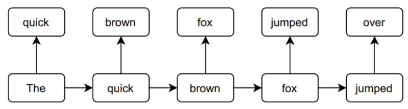
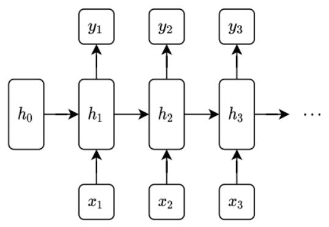
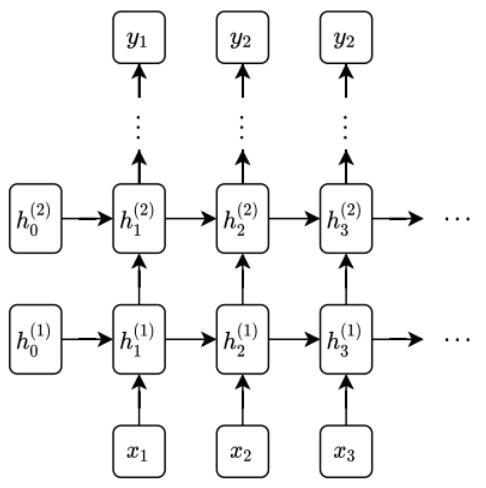

# 序列建模和循环神经网络

## 大纲
- 序列建模一般概念
- RNN（深度学习中的序列建模） Recurrent neural networks
- LSTM（RNN的一个特定实例，long short-term memory）
- RNN能做的


## 序列建模概念
- 背景：之前的输入数据都是独立同分布的，他们之间没有内在顺序；但是实践中大部分情况的输入输出对之间形成了某种依赖序列
- 时间序列可以预测数据/标签
- 序列建模中的一个特例：自回归预测
  - 通过使用同一变量在之前各期的表现来预测该变量在当前期的表现
  - 如下图所示，预测的元素是序列中的下一个元素
  


## RNN 

- 中间有基于序列的隐藏层h0，h1...
  公式为：$$ h_t=f\left(W_{h h} h_{t-1}+W_{h x} x_t+b_h\right) \\
  y_t=g\left(W_{y h} h_t+b_y\right)$$
  (t为时间或表示序列前进的单位，f、g是激活函数)
- 怎么训练:
  - BPTT:backpropagation through time
  - 伪代码：
    ```py
    opt = Optimizer(params = (W_hh, W_hx, W_yh, b_h, b_y))
    h[0] = 0
    l = 0
    for t = 1,...,T:
        h[t] = f(W_hh * h[t-1] + W_hx * x[t] + b_h)
        y[t] = g(W_yh * h[t] + b_y)
        l += Loss(y[t], y_star[t]) # 损失累加
    l.backward() # 主要依赖自动微分
    opt.step()
    ```
- RNN叠加
  
  - RNN叠加分成时间步深度与层深度两个方面，一般为如图示的纵向叠加（叠加隐藏层层数）
  - h包含了对应y所拥有的序列依赖关系
  > 非常深的RNN的价值往往较低:
  > - 深层RNN难以有效更新底层参数，模型无法收敛或性能下降;
  > - 底层RNN的隐藏状态经过多层传递后易被稀释;
  > - 梯度指数级衰减或爆炸

- 如何减少训练rnn时梯度爆炸、消失问题
  - 损失函数对第t步参数的梯度需通过链式法则依次乘以各时间步的梯度，时间步增多时连续相乘会导致指数级增长、衰减
  - 使用有界激活函数作用不大
  > 方法：使用LSTM/GRU + 梯度裁剪 + 添加LayerNorm + 对长序列截断BPTT、限制序列长度

  > 梯度裁剪：确保梯度的范数不超过设定的阈值
  > 若梯度的L2范数超过阈值 \( \text{max\_norm} \)，则将梯度向量按比例缩放，使其范数等于阈值：
  \[
  \text{if } \|g\| > \text{max\_norm}: \quad g \leftarrow \frac{\text{max\_norm}}{\|g\|} \cdot g
  \]
  其中 \( g \) 是梯度张量，\( \|g\| \) 是其L2范数

## LSTMs
  - 将隐藏层中单元分为两部分，为隐藏状态(hidden sate)和细胞状态(cell state)
  - 公式（矩阵形式，若要单个求每个变量按相对应函数即可）：
    $$
    \begin{aligned}
    & {\left[\begin{array}{c}
    i_t \\
    f_t \\
    g_t \\
    o_t
    \end{array}\right]=\left(\begin{array}{c}
    \text { sigmoid } \\
    \text { sigmoid } \\
    \tanh \\
    \text { sigmoid }
    \end{array}\right)\left(W_{h h} h_{t-1}+\mathrm{W}_{h x} x_t+b_h\right)} \\
    & c_t=c_{t-1} \circ f_t+i_t \circ g_t  ( \circ 为对应元素相乘) \\
    & h_t=\tanh \left(c_t\right) \circ o_t \\
    & i_t,f_t,g_t,o_t,c_t,h_t \in \mathbb{R}^d\\  
    & W_{hh},W_{hx}\in \mathbb{R}^{4d\times d}  
    \end{aligned}
    $$

    图示：
    ](../images/image-55.png)
  - LSTM定义了一些中间变量，有forget gate、input gate、output gate，还有候选状态g_t
  - 我的理解：
    - 将原本隐藏层的单元之间信息的传递给细化，之前rnn只使用一个激活函数与一组d * d参数，但LSTM使用4d * d相当于一个W_hh包含四组参数，且给予各组不同功能
    - 遗忘门：通过sigmoid（0，1）值域的f_t，再 $c_{t-1} \circ f_t$ 控制前一时刻输入状态的保留比例
    - g_t是未经过重要性筛选的原始数据，确保新信息也有机会加入细胞间传递
    - 输入门：i_t决定新信息是否值得存入长期记忆，同样为sigmoid（0，1）
    - 输出门：o_t也是一个有界变量，其作用于防止梯度爆炸或者消失

## RNN能做的

- 在翻译句子中的序列到序列模型(Sequence to sequence)采用了两个RNN，一个用于输入原始句子，提取中间状态（生成摘要），另一个根据最后一个中间状态，输出翻译后的句子，类似encoder/decoder

- 双向RNN：将正向运行的RNN与反向运行的RNN堆叠起来，合并二者的隐藏状态，得到最终输出，与自回归预测不同，不只是以当前点及之前的数据预测，而是以整个序列，同时捕捉前后文信息，也代表它不适用于预测问题


