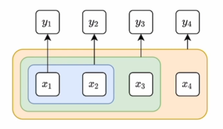
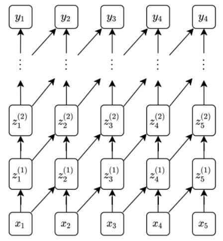
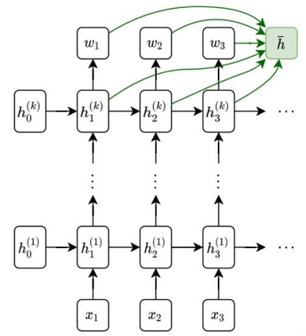
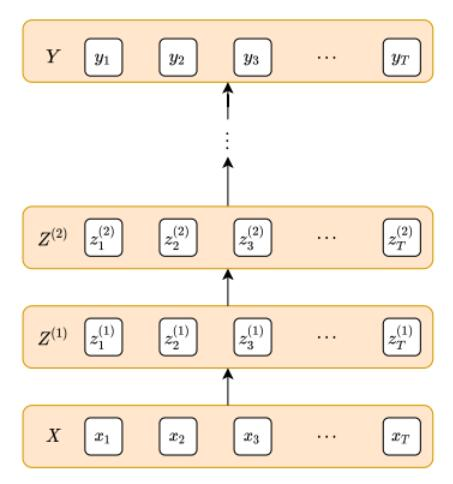
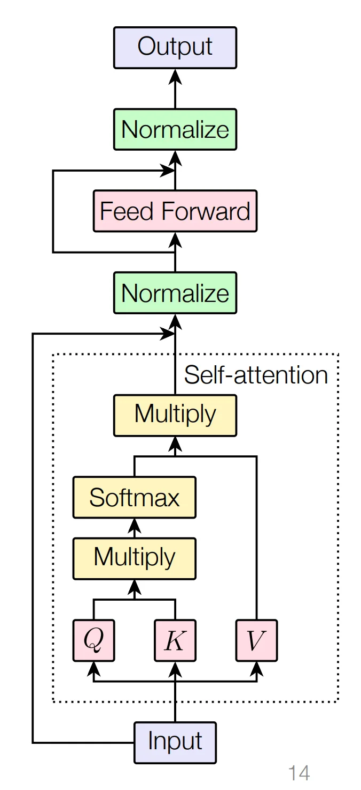
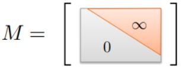

# Transformers and Attention

## 大纲
- 两种时间序列建模方法
- self-attention和Transformers

## 两种时间序列建模方法
- RNN在序列建模的主旨是潜在状态方法，用一个潜在状态描述了此时刻及之前时刻的所有信息
  - 优点是能捕获无限长的历史信息
  - 缺点是难以记住较远时刻的信息，并且容易梯度消失、爆炸
- 直接预测方法 direct prediction：
  
  由x1预测y1，x1、x2预测y2，x1x2x3预测y3...需要改变预测的函数
  - 优点：通常可以使用更短的计算路径从过去映射到当前状态
  - 缺点：没有隐藏层，实际中能捕获的历史有限

## 基于CNN的直接预测方法 时间卷积网络(TCN)

- 如图所示，隐藏层中的卷积为单向的，$z_t^{(i+1)}$ 只能取决于 $z_{t-k:t}^{(i)}$
- 显著缺点：卷积的感受野相对较小，若想要y的预测能捕获更多x，则需要增大网络的深度，代价大
- 成功应用：用于语音生成的WaveNet

## self-attention和Transformers

### 深度学习中的注意机制

- 如图所示是正常的rnn加上注意力机制，原本的rnn的最终输出只依赖于最后一个隐藏层单元的数据，这样会随着时间步增加而减少对前面输入的注意，而注意力机制就将纵向所有的h加权累加的最终输出，添加新的参数以优化，以确保可以有权衡的输出预测
- 公式： $  \bar{h}=\sum_{t=1}^T w_t h_t^{(k)} $

### 自注意力机制
- 自注意力机制意为模型自主的注意力机制，其核心思想：每个位置的信息都可以通过与其他位置的信息对话来增强自身的表示
- 公式：$ \operatorname{SelfAttention}(Q, K, V)=\operatorname{softmax}\left(\frac{K Q^T}{d^{1 / 2}}\right) V $ 
> 公式KQ^T是矩阵相乘，但它的本质是批量计算向量点积，矩阵相乘的每个元素对应一个k_i和q_i向量的点积结果；且softmax是按行为单位

  $Q, K, V\in \mathbb R^{T\times d}$

$$
    K=\left[\begin{array}{ccc}
    - & k_1^{\top} & - \\
    - & k_2^{\top} & - \\
    & \vdots & \\
    - & k_T^{\top} & -
    \end{array}\right], \quad Q=\left[\begin{array}{ccc}
    - & q_1^{\top} & - \\
    - & q_2^{\top} & - \\
    & \vdots & \\
    - & q_T^{\top} & -
    \end{array}\right], \quad V=\left[\begin{array}{ccc}
    - & v_1^{\top} & - \\
    - & v_2^{\top} & - \\
    & \vdots & \\
    - & v_T^{\top} & -
    \end{array}\right]
$$

- 三个向量Q,K,V:Query, Key, Value (可以任意交换)
  - Query（查询）：当前需要关注的位置
  - Key（键）：序列中所有位置的标识
  - Value（值）：每个位置的实际信息
  - 目标：通过计算“Query”与所有“Key”的相似度，决定“Value”的加权组合

- 理解：注意力机制的目的是增强序列中某部分注意其他部分需要注意的数据的能力，虽然QKV都是输入x的线性变化，但需要抽象的将这三者理解为不同的角色：Q可以理解为当前位置需要关注的信息需求，K可以当作其他位置被注意的标识，Q和K中的向量点乘代表 需要注意/不需要 的程度，结合softmax为概率，在乘回V（原来的各位置实际信息）得到注意权重后的新数据

### transformers

- 如上图所示，与之前的RNN与时间预测网络TCN不同，这里所有时间步长都是并行处理的，为 $Z^{(i+1)}=\operatorname{Transformer}\left(Z^{(i)}\right)$
- 图中箭头类似一个transformer block（不止），transformer block流程图如下

- 对应公式：
  - 自注意力：$\tilde{Z}:=\text { SelfAttention }\left(Z^{(i)} W_K, Z^{(i)} W_Q, Z^{(i)} W_V\right) \\
 =\operatorname{softmax}\left(\frac{Z^{(i)} W_K W_V^T Z^{(i)^T}}{d^{1 / 2}}\right) Z^{(i)} W_V$
  - 自注意力后的残差连接与层归一化：$\tilde{Z}:=\operatorname{LayerNorm}\left(Z^{(i)}+\tilde{Z}\right)$
    稳定自注意力输出与梯度
  - 前馈网络：$\operatorname{ReLU}(\tilde{Z} W)$
  > 前馈网络由两个线性变换和一个激活函数组成（如Linear → ReLU → Linear）,作用：
  > - 通过激活函数增强模型的非线性表达能力
  > - 便于维度扩展与压缩
  - 前馈网络后的残差连接与层归一化：$Z^{(i+1)}:=\operatorname{LayerNorm}(\operatorname{ReLU}(\tilde{Z} W)+\tilde{Z})$
    稳定前馈输出，加速收敛

> ##### 残差连接：减少深层模型梯度消失
> - 残差是什么：将底层模块的输入叠加在上层模块输入中，相当于除了正常一层层正向传播数据外还有跳过中间层的捷径
> - 为什么需要残差：若深层模型的输入从底层到上层只有一层层传播的路径，则反向传播时求梯度的链式法则的联乘（连乘）方式会使梯度消失
> - 而残差的捷径使反向传播除了联乘，中间层的输出还与其下层走捷径的输入有关，故反向求梯度时类似多元函数求导 = 有关变量偏导相加，这样使得底层的参数梯度会等于许多项之和，减少梯度随深度消失的问题
> - 同时底层网络参数梯度由于多项之和通常大于上层参数梯度，收敛/优化相较快，故使用残差连接使得深层模型符合正常思维：底层网络奠定轮廓，上层网络优化细节

- Transformer的优点：
    - 可以在一个block中混合所有时间步的时序信息
    - 随着时间步的增加，Transformer不需要额外引入新的参数
- 缺点：
    - 每个输出都依赖于所有时间步的输入
    - 输入没有时序，也就是说可以将时序打乱再输入给Transformer，结果还是一样的
##### 对缺点的两种改进：
##### 1. Masked self-attention 自注意力屏蔽
- Mask Matrix = M = 上三角为无限大，下三角为0的矩阵

- 改变了KQV的公式：$\operatorname{softmax}\left(\frac{K Q^T}{d^{1 / 2}}-M\right) V$
- 为什么要减M：某些情况下，不想让每个输出都依赖所有时间步的输入，尤其是不想预先得知未来的输入，故减M使得原本的KQ^T乘积的上三角部分在softmax过后会变成零，相当于屏蔽了当前时间步未来的输入

##### 2. position encoding 位置编码
- 目的：为了解决时序问题，使输入与其在序列中的位置相关联
    $$
    X \in \mathbb{R}^n=\left[\begin{array}{ccc}- & x_1^{\top} & - \\- & x_2^{\top} & - \\
    & \vdots & \\- & x_T^{\top} & -
    \end{array}\right]+\left[\begin{array}{ccc}
    \sin \left(\omega_1 \cdot 1\right) & \cdots & \sin \left(\omega_n \cdot 1\right) \\
    \sin \left(\omega_1 \cdot 2\right) & \cdots & \sin \left(\omega_n \cdot 2\right) \\
    \vdots & \ddots & \vdots \\
    \sin \left(\omega_1 \cdot T\right) & \cdots & \sin \left(\omega_n \cdot T\right)
    \end{array}\right] 
    $$
- 故加上了一个数据编码代表位置关系，用了不同频率的sin，这样模型学习位置关系的时候，通过不同频率的sin计算即可判断位置远近、先后顺序 ？？？

### transformer的挑战
- 如何表示数据使得 $O(T^2)$ 操作可行
- 如何形成位置编码
- 如何形成mask矩阵

## 总结
| 特性                | Transformer                     | RNN/LSTM                  |
|---------------------|------------------|--------------------------|
| **时间计算依赖**     | 完全并行                       | 严格时序依赖              |
| **内存消耗**         | $O(T^2d + Td^2)$               | $O(Td)$                   |
| **参数增长条件**     | 仅当增大d_model或层数时        | 仅当增大hidden_size时     |
| **长程依赖路径**     | 一步直达（任意位置）           | 多步传递（O(T)）          |

