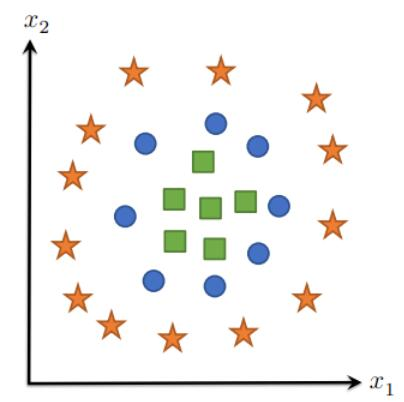

# 手动神经网络（上）

# 大纲
- 由线性假设类到非线性再到神经网络

# 由线性假设类到非线性
## 线性假设类的弊端
- 线性假设类： h(x) = Theta转置 * x ，即假设有一整块数据集，线性假设会用线性的界限将数据集分成不同块（类）
- 当数据特征不能以线性的界限来分隔出不同的类时线性假设类作用不大

## 向非线性转变
- h(x) = Theta转置 * (Phi(x)), Phi(x)对x作升维处理或其他非线性处理
- 上述"当数据特征不能以线性的界限来分隔出不同的类时"情况针对的是某一维度，如果以更高维度视角观测其数据，可能可以使线性假设类恢复作用
  > 举例：假设数据维度为x1,x2两个维度，且在二维图像中不同类的数据如图，
  则令Phi(x) = x1^2 + x2^2,则在Phi(x0),x1,x2三维图像中使用线性假设类更有利于分类

# 神经网络
- 简单说可以把它当成一个特殊的假设类，这个假设类可以分成很多层，每层都有可微的函数来生成或处理特征，最后将其组合在一起成为神经网络
- 深度学习 = 使用神经网络作为假设类的机器学习
  
## 两层神经网络
- 单数据x：h(x) = W2转置 * Sigmoid(W1转置 * x)
- 单批次数据X：h(X) = Sigmoid(X * W1) * W2
- 简单说就是把之前的Theta = {W1(n * d的矩阵),W2(d * k的矩阵)}，参数变成参数集了

## 通用函数逼近
- 定理：给定在闭区域D中的**任意**平滑函数 f 和某误差近似量epsilon，可以定义一个两层神经网络的假设类 f hat = 使得max|f(x) - f hat(x)| <= epsilon , x属于D
  > 即f hat 为此任意函数的逼近，举例：先拿出此函数数据集的两个点x1,x2(假设x1 < x2),则x1,x2之间f hat为如下：
  $\hat f(x)=f(x^{(1)}) +\max\left\{ \frac{f(x^{(2)})-f(x^{(1)})}{x^{(2)}-x^{(1)}}(x-x^{(1)}), 0 \right\}, f(x^{(2)})\ge f(x^{(1)}) \\
\hat f(x)=f(x^{(2)}) -\max\left\{ \frac{f(x^{(2)})-f(x^{(1)})}{x^{(2)}-x^{(1)}}(x-x^{(1)}), 0 \right\}, f(x^{(2)})<f(x^{(1)})$
以此类推xn,xn+1之间函数，再分段叠加，实现逼近

## 全连接深度网络（多层感知机 MLP）
- 批数据处理形式表述（无偏差项bias）：
  $\begin{aligned}
    & Z_{i+1}=\sigma_i\left(Z_i W_i\right), i=1, \ldots, L 层间参数关系\\
    & Z_1=X 批数据输入矩阵\\
    & h_\theta(X)=Z_{L+1} 最终输出层结果\\
    & {\left[Z_i \in \mathbb{R}^{m \times n_i}, W_i \in \mathbb{R}^{n_i \times n_{i+1}}\right]} 维数
    \end{aligned}$

> 此处$Z_{i}$不是线性输出结果，而是线性输出经激活函数处理后的激活值
- 尽管两层神经网络已经可以逼近任意平滑函数，但经验表明多层神经网络是更有利的

---

# 手动神经网络（下）

# 大纲
- 神经网络中的反向传播求梯度
- 重点是理解多层神经网络中正、反向传播的迭代，包括每层Wi，Zi公式及维度

# 反向传播（无bias）
## 举例：两层反向传播
- 推导Loss函数对W1，W2的偏导
- 认识S = 最后一层的Z，且后文不再使用d = 两层神经网络中的隐藏层神经元数（用ni取代）

## L层反向传播
### 主要公式（批处理）
- 基于前文层间参数关系：$Z_{i+1}=\sigma_i\left(Z_i W_i\right), i=1, \ldots, L$
  与求偏导的链式法则：$\frac{\partial \ell\left(Z_{L+1}, y\right)}{\partial W_i}=\frac{\partial \ell}{\partial Z_{L+1}} \cdot \frac{\partial Z_{L+1}}{\partial Z_L} \cdot \frac{\partial Z_{L-1}}{\partial Z_{L-2}} \cdot \ldots \cdot \frac{\partial Z_{i+2}}{\partial Z_{i+1}} \cdot \frac{\partial Z_{i+1}}{\partial W_i}$

- 因为最后$\frac{\partial Z_{i+1}}{\partial W_i}$由层间参数关系易得其$= \begin{aligned}
& \frac{\partial \sigma_i\left(Z_i W_i\right)}{\partial Z_i W_i} \cdot \frac{\partial Z_i W_i}{\partial W_i}=\sigma^{\prime}\left(Z_i W_i\right) \cdot Z_i \\
\end{aligned}$
  故前面的迭代部分，即$\frac{\partial \ell}{\partial Z_{L+1}} \cdot \frac{\partial Z_{L+1}}{\partial Z_L} \cdot \frac{\partial Z_{L-1}}{\partial Z_{L-2}} \cdot \ldots \cdot \frac{\partial Z_{i+2}}{\partial Z_{i+1}}$定义为 $G_{i+1}=\frac{\partial \ell\left(Z_{L+1}, y\right)}{\partial Z_{i+1}}$
  
- 同时由于偏导计算由后向前链式计算，故$G_{i}$也反向迭代，有$G_i=G_{i+1} \cdot \frac{\partial Z_{i+1}}{\partial Z_i}=G_{i+1} \cdot \frac{\partial \sigma_i\left(Z_i W_i\right)}{\partial Z_i W_i} \cdot \frac{\partial Z_i W_i}{\partial Z_i}=G_{i+1} \cdot \sigma^{\prime}\left(Z_i W_i\right) \cdot W_i$
> 1. 前向迭代求Zi:初始化：$Z_1=X$
> 迭代：$Z_{i+1}=\sigma_i(Z_i W_i),i=1,\ldots, L$
> 2. 反向迭代求Gi:初始化：$G_{L+1}=\nabla_{Z_{L+1}} \ell\left(Z_{L+1}, y\right)=S-I_y$
> 迭代：$G_i=\left(G_{i+1} \circ \sigma_i^{\prime}\left(Z_i W_i\right)\right) W_i^T, \quad i=L, \ldots, 1$
> 3. 迭代中需要缓存各Z,G，高效的缓存方式可以提高传播效率

### 具体实现
- 因为前文公式只是理想的推导，若要求实际的梯度，则还需要考虑各矩阵、向量的维度匹配，使变量间能正常运算（与前文lecture2中偏导用链式法则的原因相同）
- 矩阵大小：$Z_i \in \mathbb{R}^{m \times n_i}, W_i \in \mathbb{R}^{n_i \times n_{i+1}}, G_i=\frac{\partial \ell\left(Z_{L+1}, y\right)}{\partial Z_i}=\nabla_{Z_i} \ell\left(Z_{L+1}, y\right) \in \mathbb{R}^{m \times n_i}$
- 发现需要改正的公式为：
  - $G_i=G_{i+1} \cdot \sigma^{\prime}\left(Z_i W_i\right) \cdot W_i=\left(G_{i+1} \circ \sigma^{\prime}\left(Z_i W_i\right)\right) W_i^T$

  - $\frac{\partial \ell\left(Z_{L+1}, y\right)}{\partial W_i}=G_{i+1} \cdot \frac{\partial \sigma_i\left(Z_i W_i\right)}{\partial Z_i W_i} \cdot \frac{\partial Z_i W_i}{\partial W_i}=G_{i+1} \cdot \sigma^{\prime}\left(Z_i W_i\right) \cdot Z_i \\$改正 $ \Longrightarrow $ **$ \nabla_{W_i} \ell\left(Z_{L+1}, y\right)=Z_i^T\left(G_{i+1} \circ \sigma^{\prime}\left(Z_i W_i\right)\right)$**
  > 注意 $\circ$ 符号变化，由叉乘（前矩阵列=后矩阵行）变成点乘（两矩阵维度相同）

- 发现迭代可以形式化为 = 迭代值 * 本层导数 （雅可比积），故可自动微分。

下节课学习自动微分...

