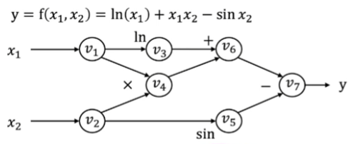
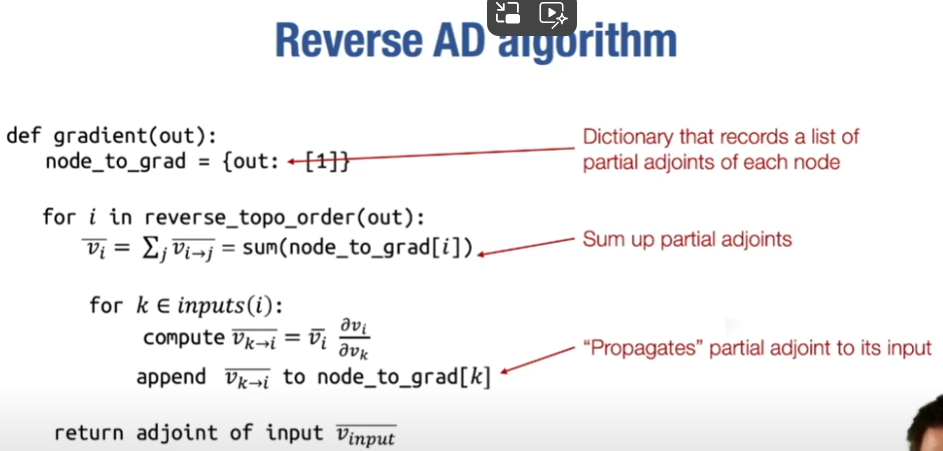
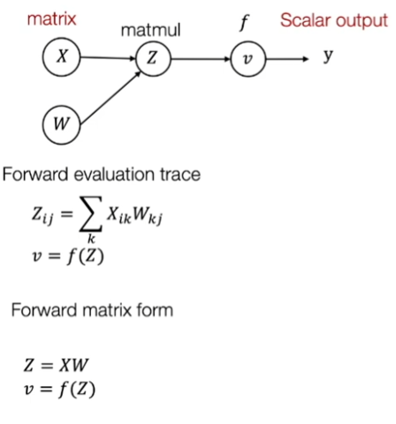
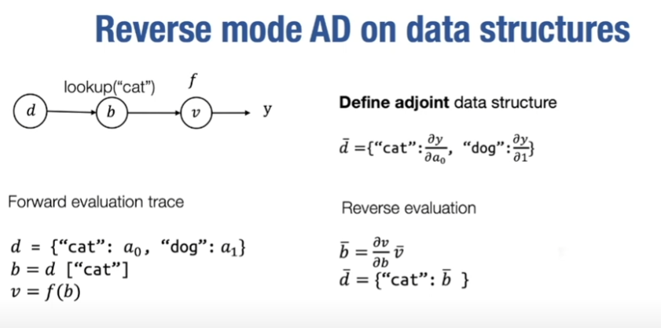

# 自动微分

# 大纲

# 

## 数值微分法
- lim epsilon->0((f(Theta + epsilon * ei) - f(Theta))/epsilon)  //ei为i方向为1其余方向为零的向量，大致就是高数导数的极限法求微分
- 用泰勒展开估计f(Theta + a) = f(Theta) + f'(Theta) * a + 1/2 * f"(Theta) * a^2 + O(a^3)，而f(Theta + a)与f(Theta - a)的估计中二阶导项符号相同，

  故可以抵消二阶导项，使微分更精确：$\frac{\partial f(\theta)}{\partial \theta_i}=\frac{f\left(\theta+\epsilon e_i\right)-f\left(\theta-\epsilon e_i\right)}{2 \epsilon}+o\left(\epsilon^2\right)$

- 缺陷：
  1. 如果不能使epsilon足够小，会导致较大的误差
  2. 需要求两次n阶f，too costly

- 但是可以用它来检测自动微分是否正确：$\delta^T \nabla_\theta f(\theta)=\frac{f(\theta+\epsilon \delta)-f(\theta-\epsilon \delta)}{2 \epsilon}+o\left(\epsilon^2\right)$
  这里的 $\delta$ 指一个任意非零的方向向量，用于指定计算方向导数的方向

## 符号微分
- 通过求和、乘积公式和链式法则推导出梯度
- 缺陷：会进行多次重复运算，繁琐且不必要，故引出计算图

## 计算图
- 有向无环图，用于表示为某函数执行的计算，包括执行顺序
- 举例：

## 前向模式的自动微分
- 以拓补排序进行微分推导
- 举例：以上文计算图为例有 $\dot{v}_i=\frac{\partial v_i}{\partial x_1}$ ,
  $\dot{v_1}$ , $\dot{v_2}$ 可以直接算，后面的由链式法则也易得结果

- 前向模式自动微分的限制：对于神经网络n维输入k维输出，n很小时其适用，但n较大时需要n次传递来获得关于每个输入的梯度，而神经网络主要是n很大且k=1的情况故其不适用

## 反向模式的自动微分

- 伴随(adjoint):输出标量对每个中间值节点的偏导数
- 此方法大意与前向模式相反： $ \bar{v}_i=\frac{\partial y}{\partial v_i} $ 
  > 即此处的 $\bar{v}_i$ 就是前文的Gi的较微观形式

  从计算图末尾向前计算，仍以上计算图举例：易得 $\overline{v_7}=\frac{\partial y}{\partial v_7}=1  ;\\  \overline{v_6}=\bar{v}_7 \frac{\partial v_7}{\partial v_6}=\overline{v_7} \times 1=1 ;\\ \dots \\ \overline{v_2}=\overline{v_5} \frac{\partial v_5}{\partial v_2}+\overline{v_4} \frac{\partial v_4}{\partial v_2}=\overline{v_5} \times \cos v_2+\bar{v}_4 \times v_1=-0.284+2=1.716 ;\\ \overline{v_1}=\bar{v}_4 \frac{\partial v_4}{\partial v_1}+\overline{v_3} \frac{\partial v_3}{\partial v_1}=\overline{v_4} \times v_2+\bar{v}_3 \frac{1}{v_1}=5+\frac{1}{2}=5.5$
- 上述v2,v1求法基于： $ \overline{v_1}=\frac{\partial y}{\partial v_1}=\frac{\partial f\left(v_2, v_3\right)}{\partial v_2} \frac{\partial v_2}{\partial v_1}+\frac{\partial f\left(v_2, v_3\right)}{\partial v_3} \frac{\partial v_3}{\partial v_1}=\overline{v_2} \frac{\partial v_2}{\partial v_1}+\overline{v_3} \frac{\partial v_3}{\partial v_1} $ 其余情况类似
- 前文的伴随： $\overline{v_{i \rightarrow j}}=\bar{v}_j \frac{\partial v_j}{\partial v_i}$
- 故可以得出（多路径情况中） $ \bar{v}_i=\sum_{j \in \text { next }(i)} \overline{v_{i \rightarrow j}}$
> 注意这里 伴随: $\overline{v_{i \rightarrow j}}$ 和 总梯度: $ \bar{v}_i$ 的关系！！

这样就可以以代码实现

## 反向自动微分算法实现

- 实例计算，通过拓展计算图的方式(创建额外的图节点反向求梯度)将原有输入与其对应梯度构建关系，而并非如前文举例为输入仅为标量定值的情况
- 对比前文反向传播：
  1. 其结果仍然是一个计算图，故可以仅通过拓展此计算图，改变其输出形式..等拓展操作
  2. 可以计算梯度的梯度，如此叠加
  3. 可以简化某些等价的图节点，提高计算效率

## 反向自动微分推广至多维向量
- 其实本质上是伴随(adjoint)定义的拓展：$$\bar{Z}=\left[\begin{array}{ccc}
\frac{\partial y}{\partial z_{1,1}} & \ldots & \frac{\partial y}{\partial z_{1, n}} \\
\vdots & \ldots & \vdots \\
\frac{\partial y}{\partial z_{m, 1}} & \ldots & \frac{\partial y}{\partial z_{m, n}}
\end{array}\right]$$

举例：

- 在举例中，推广方法为由矩阵标量元素先依照前文标量情况推导，再由标量间矩阵下标的关系将标量总梯度变为矩阵运算形式

- 再推广至普遍的数据结构
  - 同理是改变伴随的定义：需定义与前向传播的节点值与箭头所代表的传播方式相匹配的数据结构（类型）

举例： 

- 数据的n维特征元素类型变成字典类型和部分层间函数变成查找函数
> 原理就是单个数据的特征原本是类似一个n元数组或者n维向量，数组查找是下标查找而现在字典类型变成了字符串的映射查找（简单说就是特征的下标由0123..变成字符串了）

