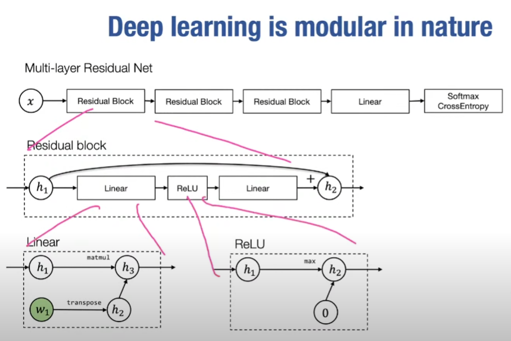

# 神经网络库抽象

## 大纲
- 2 parts
- 可使用的编程抽象以构建机器学习模型
- 高级模块化组件及有效分解机器学习库设计

## 编程抽象
### 1. Caffe 1.0
- 在原计算图原地反向传播
- 设计层类，每层可执行两个操作，分别是前向传播，反向传播求梯度，propagate_down为特定标志以助于执行某优化

```py
class Layer:
    def forward(bottom, top):
    	pass
    	
    def backward(top,propagate_down,bottom):
    	pass
```
- 第一代深度学习框架

### 2. Tensorflow 1.0(计算图和声明式编程)
```py
import tensorflow as tf

v1 = tf.Variable()
v2 = tf.exp(v1)
v3 = v2 + 1
v4 = v2 * v3

sess = tf.Session()
value4 = sess.run(v4, feed_dict={v1: numpy.array([1]})
```

- 先构造计算图，再创建会话运行计算图（feed_dict），这就是声明式编程：先声明计算而后执行
- 优势：
  1. 先声明计算图意味着当你想计算某些感兴趣的部分时，可以跳过一些不必要的计算，如可以跳过损失函数计算直接计算反向梯度
  2. 能部分在不同机器上运行，运行计算图的可拓展性，计算图与当前交互式主机API分离
- 缺点：调试困难，需要在运行步骤中加入v1值后运行才能得知v2值..


### 3. PyTorch（命令式自动微分API）
以needle为例：
```py
import needle as ndl

v1 = ndl.Tensor([1])
v2 = ndl.exp(v1)
v3 = v2 + 1
v4 = v2 * v3
```
- 支持在构建计算图时执行计算（分成Eager/Lazy模式），且可以混合python的控制流程，例如在构建计算图时可以：
```py
if v4.numpy() > 0.5:
	v5 = v4 * 2
else:
	v5 = v4
v5.backward()
```

- 与Tensorflow不同之处在于静态计算图构建与动态计算图构建（运行时定义）
- 无以上Tensorflow优化的优势（内存重用等优化），但其优势在于：
  1. 更自然的将python与其他语言混合（可以将计算图构建当作一类编程语言）
  2. 易于调试，在构建计算图时就加入v1的值，故在构建时就可以即时打印节点值
  3. 灵活，例如计算图会基于输入节点某些特征而改变，pytorch能轻松构建动态计算图


## 模块化编程实现
- 问题：如何将机器学习三要素（假设类、损失函数、优化）转化为代码中的模块化组件

深度学习模块化示意图：


- 能够将不同的深度学习解决方案组合在一起，且更新模块所需要的代价远小于重建整个神经网络

### nn.Module数据结构



- 深度学习本质上是模块化的，如上示意图，将模块组合在一起需要考虑：参数初始化、集合参数列表等

- 将模块组合，模块之中也可以有模块，可以递归组合
- 遵循张量输入，张量输出的原则

### Loss function
- 输入为h(x)和y（张量），输出为损失（标量值）
- 多目标预测：基于多个目标函数，如何组合？

### 优化器 optimizer
示意图：


优化器为其中绿色部分，接收nn.module的参数表与梯度并以梯度下降更新之

作用：
- 从模型中获取权重列表，执行优化步骤
- 分为普通优化器与动量优化器
- SGD优化： $w_i \leftarrow w_i-\alpha g_i$ 

### 正则化 Regularization
- 正则化意为给损失函数加上一些限制，以避免模型过拟合
- 正则化步骤可实现在：
  （1）作为损失函数的一部分实现 
  （2）合并在优化器的优化中(权重衰减项)
- 带有L2正则化的SGD： $w_i \leftarrow(1-\alpha \lambda) w_i-\alpha g_i$ 
  > L2 正则化：也称为 Ridge 正则化，它通过在模型的损失函数中增加权重的 L2 范数（权重向量的平方和）来实现正则化。L2 正则化会使权重值变得较小，但不会直接导致权重稀疏，因此不具有特征选择的作用，但可以有效地控制模型的复杂度。 

### 初始化 initialization
- 初始化参数太大，经过几轮神经网络的数据会爆炸；太小则会接近于零
- 偏差项（bias）可以初始化为零，其余可以使用均匀分布或高斯分布
- 在nn.module中初始化可合并在其构造阶段

### 数据加载与预处理
- 不同方法举例：
   - 通过随机打乱输入来预处理和扩充训练集（不同类型的数据增强）
   - 仿射变换或对图像的旋转、抖动以确保扩大输入空间..
- 数据加载和扩充本质上也是可组合的，可以用模块的组合构建一个数据预处理单步流水线，如下图：


